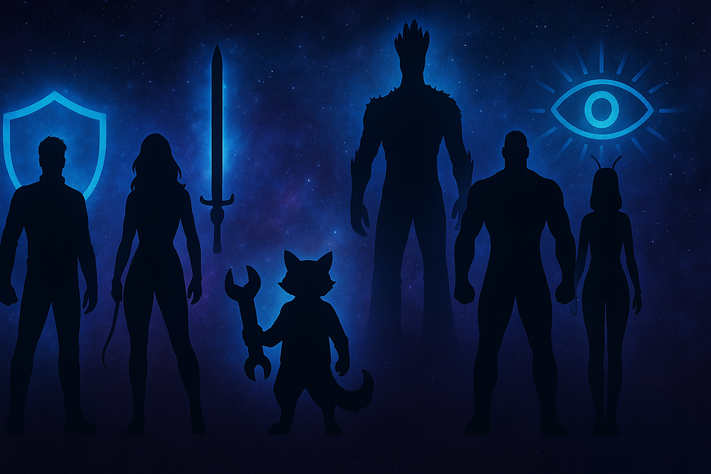
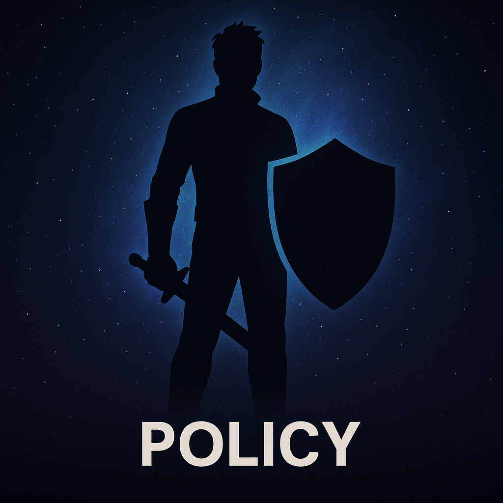
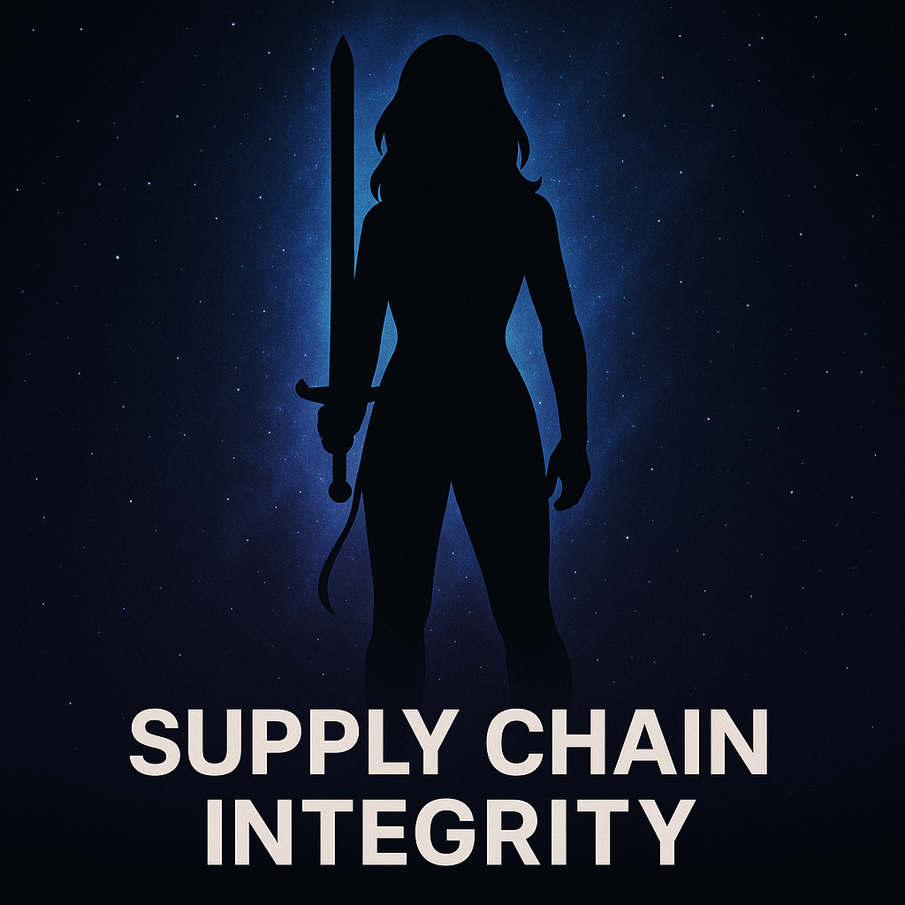
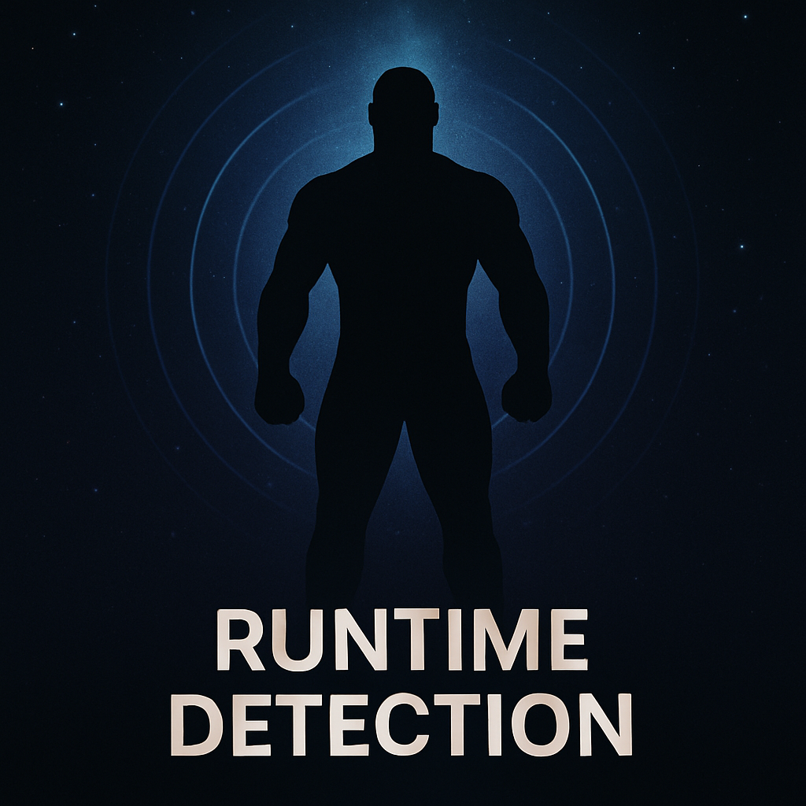
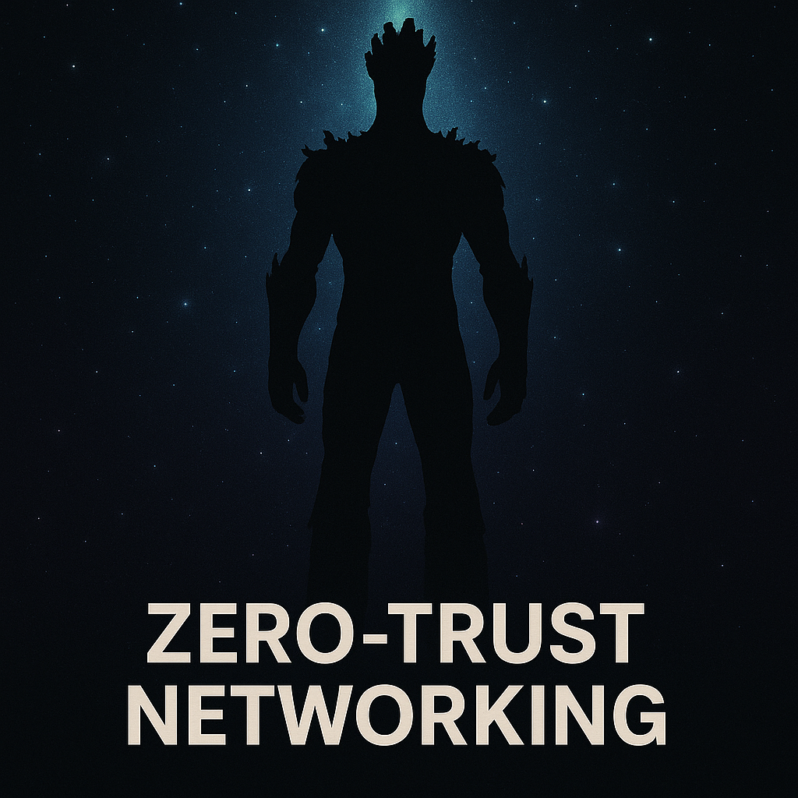

<!-- _color: white -->

# <!-- fit --> Guardians of the Container Galaxy

<div class="columns">
<div>

## Defending the Cosmic Cluster

</div>
<div>

### Chris Ayers
#### Senior Software Engineer
#### Microsoft

</div>



---


## Chris Ayers

### Senior Software Engineer<br>Azure CXP AzRel<br>Microsoft

<i class="fa-brands fa-bluesky"></i> BlueSky: [@chris-ayers.com](https://bsky.app/profile/chris-ayers.com)
<i class="fa-brands fa-linkedin"></i> LinkedIn: - [chris\-l\-ayers](https://linkedin.com/in/chris-l-ayers/)
<i class="fa fa-window-maximize"></i> Blog: [https://chris-ayers\.com/](https://chris-ayers.com/)
<i class="fa-brands fa-github"></i> GitHub: [Codebytes](https://github.com/codebytes)
<i class="fa-brands fa-mastodon"></i> Mastodon: [@Chrisayers@hachyderm.io](https://hachyderm.io/@Chrisayers)
~~<i class="fa-brands fa-twitter"></i> Twitter: @Chris_L_Ayers~~

---

## Container Security: The Challenge

**Modern Container Threats:**
- Supply Chain Attacks (SolarWinds, Codecov, 3CX)
- Runtime Exploits (Cryptojacking, Container Escape)
- Lateral Movement (Flat Networks)
- Visibility Gaps (Lack of Observability)

---

## Container Security: The Impact

**The Numbers:**
- 51% of images contain HIGH/CRITICAL CVEs
- 742% increase in supply chain attacks
- 200+ days dwell time without runtime detection

---

## The Container Attack Kill Chain

1. **Initial Compromise** → Poisoned base image
2. **Build Integration** → Survives CI/CD (no scanning)
3. **Registry Storage** → Unsigned artifact
4. **Deployment** → Privileged container
5. **Runtime Execution** → Crypto mining payload
6. **Network Discovery** → Flat network recon
7. **Lateral Movement** → Compromise database
8. **Persistence** → Backdoors & exfiltration

---

## Defense in Depth Strategy

**Build** → **Deploy** → **Run** → **Observe**

**Shift Left + Shield Right**

- **Shift Left:** Find & fix early (SBOM, scan, sign)
- **Shield Right:** Detect & contain (runtime, network)

**No single control is perfect → Layer them**

---

## The Guardians Framework

**6 Security Layers** mapped to Guardians characters:

- 🎯 **Star-Lord** → Policy & Governance
- ⚔️ **Gamora** → Supply Chain Integrity
- 🔧 **Rocket** → Image Hardening
- 💪 **Drax** → Runtime Detection
- 🌳 **Groot** → Network Segmentation
- 🔮 **Mantis** → Observability

**Why?** Memorable, team-based defense

---

## Security Foundation: Defense in Depth

**No single control is perfect**

Multiple independent layers catch what others miss:
- Build-time scanning misses zero-days → Runtime detection catches them
- Signed images prevent tampering → Policies enforce verification
- Network segmentation limits blast radius → Observability shows the attack

**Think:** Swiss cheese model - holes align rarely

---

## Defense in Depth: Example

**Log4Shell (CVE-2021-44228) Response:**

| Layer | Detection/Response |
|-------|-------------------|
| **Layer 1 - Scanning** | Found vulnerable Log4j versions in images |
| **Layer 2 - Runtime** | Detected exploitation attempts (JNDI lookups) |
| **Layer 3 - Network** | Blocked C2 communication attempts |
| **Layer 4 - Observability** | Correlated timeline, full incident reconstruction |

**One layer missed = others still protect**

---

## Security Foundation: Shift Left

**Shift Left = Find & Fix Early (Build-time)**

- Find vulnerabilities **before** deployment
- Cheaper to fix (minutes vs hours/days)
- Gate on critical findings
- Prevent known issues from reaching production

**Tools:** SBOM generation, vulnerability scanning, image signing

**Goal:** Catch 80% of issues before they deploy

---

## Security Foundation: Shield Right

**Shield Right = Detect & Contain (Runtime)**

- Detect what bypasses build controls
- Zero-days, insider threats, misconfigurations
- Continuous monitoring & response
- Assume breach, limit blast radius

**Tools:** Behavioral detection (Falco), network policies, observability

**Statistics:** 200+ days average dwell time without runtime detection

**Both Required:** Shift Left + Shield Right = Complete coverage

---

## Security Foundation: Zero Trust

**Traditional Perimeter Model:**
- Trust everything inside the firewall
- Network location = implicit identity
- Once breached, lateral movement is easy
- Perimeter defense only

**Problem:** Kubernetes has no perimeter!

---

## Zero Trust

**Zero Trust Model:**
- **Never trust, always verify**
- **Identity-based access** (not network location)
- **Assume breach** (segment everything)
- **Continuous verification** (every request)

---

## Zero Trust for Containers

**Applied to Containers:**
- Unsigned images → ❌ Blocked
- Root containers → ❌ Denied
- Flat networks → ❌ Segmented
- No policies → ❌ Default deny

**Standard:** NIST SP 800-207

---

## Security Foundation: Supply Chain Security

**The Problem:** Trust is a vulnerability

**You don't control:**
- Base images (Docker Hub, public registries)
- Transitive dependencies (your deps pull other deps)
- Build tools (npm, Maven, compilers)
- Registry infrastructure (can be compromised)

**Every layer is a potential attack vector**

---

## Supply Chain: Real Attacks

**Real-World Supply Chain Breaches:**

- **SolarWinds (2020):** Build system compromised → 18,000 customers infected
- **Codecov (2021):** Bash upload script modified → credentials stolen for months
- **3CX (2023):** Desktop app trojanized → widespread supply chain malware
- **Event-Stream NPM (2018):** Maintainer added Bitcoin wallet stealer

**Defense:** SLSA Framework (Levels 0-4)
- **Level 2+** = Signed provenance, hardened builds

---

## Security Foundation: Observability for Security

**The Gap:** Siloed tools, siloed teams

**Without Correlation:**
- **Ops team:** "API is slow" (looks at Grafana)
- **Security team:** "No alerts" (checks SIEM)
- **Reality:** Crypto miner running for days
- **Problem:** No one connects the dots

---

## Observability: The Solution

**With Correlation:**

**Timeline:**
- **9:00 AM:** API latency spike (APM traces)
- **9:02 AM:** High CPU usage (Prometheus metrics)
- **9:02 AM:** Suspicious process detected (Falco alert)

**Context:** Same pod, same trace ID, same namespace

**Result:** Detected in **minutes**, not days. Full forensic timeline.

**Goal:** Mean Time To Respond (MTTR) < 1 hour

---

## Why CNCF Projects?

✅ **No vendor lock-in** (portable, multi-cloud)
✅ **Community-driven** (thousands of contributors)
✅ **Production-proven** (Fortune 500 usage)
✅ **Composable** (designed to work together)
✅ **Transparent roadmap** (public planning)

**Maturity Levels:**
- **Graduated:** Falco, OPA, Cilium, Prometheus
- **Incubating:** Kyverno, OpenTelemetry, Sigstore
- **Sandbox:** Trivy, Tetragon

---

<!-- _class: lead -->
# Guardian #1
## 🎯 Star-Lord
### Policy Orchestration



---

## Star-Lord: Security Concept
### Admission Control

**Kubernetes Dynamic Admission Controllers** act as gatekeepers:

- Intercept API requests **before** objects are created
- Validate against security policies
- Mutate workloads to add security defaults
- Deny non-compliant deployments

**Think:** Airport security screening for container deployments

---

## Star-Lord: Policy as Code

**Why Policy as Code?**

- **Version controlled:** Track all policy changes in Git
- **Peer reviewed:** Security team approves policy updates
- **Same policies everywhere:** CI/CD and production cluster
- **Audit trail:** Who changed what and when

**CNCF Tools:**
- **Kyverno** (YAML-based, Kubernetes-native)
- **OPA/Gatekeeper** (Rego language, multi-platform)

---

## Star-Lord: Common Image Policy Patterns

**Image Security:**
- Require signed images (verify with Cosign)
- Block images from untrusted registries
- Deny :latest tag (enforce immutable tags)

---

## Star-Lord: Common Pod Policy Patterns

**Pod Security:**
- Require non-root user
- Disallow privileged containers
- Drop all Linux capabilities by default

---

## Star-Lord: Common Configure Policy Patterns


**Configuration:**
- Require resource limits
- Enforce specific labels (team, cost-center)

---

## Demo #1: Star-Lord
### Policy Enforcement with Kyverno

**What We'll Show:**

1. Deploy Kyverno admission controller
2. Apply policy: Require signed images + non-root
3. Try unsigned image → ❌ **Blocked**
4. Try root container → ❌ **Denied**
5. Deploy compliant workload → ✅ **Success**

---

<!-- _class: lead -->
# Guardian #2
## ⚔️ Gamora
### Supply Chain Integrity



---

## Gamora: Supply Chain Threats

**Real-World Attacks:**

- **SolarWinds (2020):** Build system compromise → 18,000 customers infected
- **Codecov (2021):** Bash uploader modified → credentials stolen for months
- **3CX (2023):** Desktop app trojanized → supply chain malware
- **Event-Stream NPM (2018):** Maintainer added Bitcoin stealer

**Common Thread:** Trust without verification

---

## Gamora: Supply Chain Defense Layers

**SBOM (Software Bill of Materials):**
- Inventory of **all** components (direct + transitive dependencies)
- Standards: SPDX, CycloneDX
- **Value:** Know what's in your container

---

## Gamora: Vulnerability Defense Layers

**Vulnerability Scanning:**
- Match packages against CVE databases
- Severity scoring (CVSS)
- **Gate:** Fail builds on HIGH/CRITICAL

---

## Gamora: Vulnerability Defense Layers

**Cryptographic Signing:**
- Keyless with OIDC (no key management!)
- Sigstore: Cosign + Rekor + Fulcio
- **Verify:** Only signed images deploy

---

## Gamora: SLSA Framework

**Supply chain Levels for Software Artifacts**

- **Level 0:** No guarantees (status quo)
- **Level 1:** Build provenance exists
- **Level 2:** Signed provenance (tamper-proof)
- **Level 3:** Hardened build platform
- **Level 4:** Two-party review

**Goal:** Move from Level 0 → Level 2+ for production

**Standard:** OpenSSF (Open Source Security Foundation)

---

## Demo #2: Gamora
### Complete Supply Chain Pipeline

**What We'll Show:**

1. Generate SBOM with Syft → See all packages
2. Scan image with Trivy → Find CVEs
3. Sign with Cosign → Keyless OIDC signature
4. Verify signature → Cryptographic proof
5. Deploy with policy → Only signed allowed

**Key Takeaway:** Cryptographic trust from build to deploy

---

<!-- _class: lead -->
# Guardian #3
## 🔧 Rocket
### Image Hardening


---

## Rocket: Attack Surface Equation

**Packages + Privileges = Exploit Opportunities**

**Traditional Base Image (ubuntu:22.04):**
- 100+ OS packages
- Bash shell
- Package manager (apt)
- Debugging tools (curl, wget, netcat)
- **Result:** Many CVEs, large attack surface

**Every package is a potential vulnerability**

---

## Rocket: Distroless Philosophy

**What is Distroless?**

- **Only runtime dependencies** (language runtime + your app)
- **No shell** (bash, sh) → Can't RCE via shell injection
- **No package manager** → Can't install malware
- **No OS utilities** → Minimal attack surface

---

## Rocket: Distroless Philosophy

**Numbers:**
- Ubuntu base: ~80MB, 100+ packages
- Distroless: ~2-20MB, <10 packages
- **Result:** 60-80% fewer CVEs

---

## Rocket: Multi-Stage Builds

**Separate Build and Runtime:**

```dockerfile
# Stage 1: Build (has compilers, tools)
FROM node:18 AS builder
WORKDIR /app
COPY package*.json ./
RUN npm ci --only=production

# Stage 2: Runtime (minimal)
FROM gcr.io/distroless/nodejs18-debian11
COPY --from=builder /app /app
USER nonroot:nonroot
CMD ["app/index.js"]
```

**Build tools never reach production**

---

## Demo #3: Rocket
### Image Hardening Before/After

**What We'll Show:**

1. Scan "before" (node:18) → Count CVEs
2. Scan "after" (distroless) → Count CVEs
3. Compare: **60-80% reduction**
4. Compare sizes: **50%+ smaller**
5. Show: No shell in distroless container

**Key Takeaway:** Minimal base = minimal risk

---

<!-- _class: lead -->
# Guardian #4
## 💪 Drax
### Runtime Detection



---

## Drax: Why Runtime Detection?

**Build-time scanning can't detect:**

- **Zero-day exploits** → No CVE exists yet
- **Fileless attacks** → Malware in memory only
- **Living-off-the-land** → Abuse curl, bash, legitimate tools
- **Insider threats** → Authorized malicious actions
- **Configuration drift** → Runtime container changes

**Statistics:** 200+ days average dwell time without runtime detection

**You need eyes on running containers**

---

## Drax: eBPF Technology

**Extended Berkeley Packet Filter**

**What is eBPF?**
- Kernel-level syscall monitoring
- Verified safe by kernel (can't crash system)
- JIT compiled (near-native performance <1% overhead)
- Event-driven (zero cost when idle)
- **Can't be bypassed** by userspace malware

**Used by:** Cilium, Falco, Tetragon, Pixie, Hubble

**Industry consensus:** eBPF is the future of observability

---

## Drax: Detection Patterns

**File System Tampering:**
- Writes to /etc, /bin, /usr/bin
- Credential theft (/root/.ssh)
- Config tampering

---

## Drax: Process Patterns

**Process Anomalies:**
- Shell spawning in non-interactive containers
- Unexpected binary execution (/tmp)
- Crypto miners (high CPU + network)

---

## Drax: Network Patterns

**Network Anomalies:**
- Unexpected egress (data exfiltration)
- C2 beacon connections
- Crypto mining pools

---

## Demo #4: Drax
### Runtime Detection with Falco

**What We'll Show:**

1. Deploy Falco with modern eBPF
2. Apply custom rule: Detect /etc writes
3. Monitor Falco logs real-time
4. Trigger: Pod writes /etc/shadow, /etc/passwd
5. Observe: Alerts with pod, file, user context

**Key Takeaway:** Detect malicious behavior instantly

---

<!-- _class: lead -->
# Guardian #5
## 🌳 Groot
### Zero-Trust Networking



---

## Groot: The Lateral Movement Problem

**Kubernetes Default: Flat Network**

- Any pod can reach any other pod
- No network boundaries between namespaces
- Attacker compromises frontend → pivots to database
- Single vulnerability = full cluster access

**Real Attack:** Capital One breach (2019)
- SSRF in web app → AWS metadata service
- Stolen credentials → S3 bucket access
- **Lesson:** Flat networks enable easy lateral movement

---

## Groot: Traditional Principles

**Traditional Perimeter Security:**
- Trust everything inside the firewall
- Network location = implicit trust
- Breach = game over

---

## Groot: Zero Trust Principles

**Zero Trust:**
- **Never trust, always verify**
- **Identity-based access** (pod labels, not IPs)
- **Deny by default** (explicit allow only)
- **Least privilege** (minimum necessary access)
- **Continuous verification**

**Standard:** NIST SP 800-207 (Zero Trust Architecture)

---

## Groot: Kubernetes NetworkPolicies

**How They Work:**

- **Label selectors:** Match pods by labels (app=frontend)
- **Ingress rules:** Who can connect TO this pod
- **Egress rules:** Where this pod can connect TO
- **Namespace boundaries:** Isolate tenants/environments

---

## Groot: Kubernetes NetworkPolicies

**CNI Plugin Required:**
- Calico, Cilium, Weave Net (Docker Desktop doesn't support!)
- Use kind cluster for demos

**Default:** Allow all → **Change to:** Deny all + explicit allow

---

## Demo #5: Groot
### Zero-Trust Network Policies

**What We'll Show:**

1. Deploy 3-tier app (flat network)
2. Test: All pods can reach each other
3. Apply default-deny → All blocked
4. Test: Tester can't reach API/DB ✅
5. Apply allow rules → Only approved paths
6. Test: Frontend→API→DB works, rest blocked ✅

**Key Takeaway:** Contain breaches, prevent lateral movement

---

<!-- _class: lead -->
# Guardian #6
## 🔮 Mantis
### Security Observability


---

## Mantis: The Observability Gap

**Siloed Teams, Siloed Tools:**

**Without Correlation:**
- **Ops team:** "API is slow" (looks at Grafana)
- **Security team:** "No alerts" (checks SIEM)
- **Reality:** Crypto miner running for days

---

## Mantis: Observability Correlation

**With Correlation:**
- **9:00 AM:** API latency spike (APM)
- **9:02 AM:** High CPU usage (Prometheus)
- **9:02 AM:** Suspicious process (Falco alert)
- **Context:** Same pod, same trace ID
- **Result:** Detected in minutes, not days

---

## Mantis: Correlated Signals

**Link Events Across Layers:**

- **Application traces:** Distributed request flow (OpenTelemetry)
- **Security events:** Falco alerts (behavioral anomalies)
- **Network denials:** NetworkPolicy blocks (lateral movement attempts)
- **Infrastructure metrics:** CPU spikes, memory pressure


---

## Mantis: The Observability Context

**Common Context:**
- Pod name, namespace
- Trace ID (links requests across services)
- Timestamp (timeline reconstruction)

**Goal:** Mean Time To Respond (MTTR) < 1 hour

---

## Mantis: OpenTelemetry for Security

**Why OTEL Matters:**

**Traces:** Show which services were accessed during incident

**Metrics:** Detect resource anomalies (CPU spike = crypto miner)

**Logs:** Capture security-relevant events with context

**Vendor-Neutral:** Single instrumentation → any backend
- Jaeger, Prometheus, Grafana
- Datadog, New Relic, Splunk
- **No lock-in**

---

## Demo #6: Mantis
### Observability Correlation

**What We'll Show:**

1. Deploy OTEL collector + instrumented app
2. Deploy Falcosidekick → Route alerts to OTEL
3. Generate traffic → See traces in logs
4. (Optional) Trigger Falco → Correlate trace ID
5. View timeline → App + security events

**Key Takeaway:** Link security to business impact

---

## Tool Landscape Comparison

| Layer | CNCF/OSS | AWS | Azure | GCP |
|-------|----------|-----|-------|-----|
| **Policy** | Kyverno, OPA | Pod Security | Azure Policy | Policy Controller |
| **Supply Chain** | Trivy, Cosign | ECR Scan, Signer | ACR Scan | Artifact Registry |
| **Runtime** | Falco | GuardDuty | Defender | Security Center |
| **Network** | Calico, Cilium | VPC CNI | Azure CNI | GKE Dataplane V2 |
| **Observability** | OTEL, Prometheus | CloudWatch | Azure Monitor | Cloud Monitoring |

---

## Why We Chose These Tools

| Guardian | Tool | CNCF Status | Why? |
|----------|------|-------------|------|
| Star-Lord | Kyverno | Incubating | YAML policies, K8s-native |
| Gamora | Trivy + Cosign | Sandbox + Incubating | All-in-one, keyless signing |
| Rocket | Distroless | OSS (Google) | Dramatic CVE reduction |
| Drax | Falco | Graduated | Production-proven, rich rules |
| Groot | Calico | CNCF | Standard policies, widely used |
| Mantis | OpenTelemetry | Incubating | Vendor-neutral, industry standard |

---

## Attack Scenario Walkthrough

**Scenario:** Cryptominer in compromised Node.js image

| Attack Step | Guardian Response | Outcome |
|-------------|-------------------|---------|
| Poisoned base image | Gamora (scan & sign) | ❌ Missed |
| Unsigned deployment | Star-Lord (policy gate) | ❌ Should block |
| Mining process spawn | Drax (Falco detection) | ✅ Alert |
| C2 network beacon | Groot (egress policy) | ✅ Blocked |
| Lateral movement | Groot (segmentation) | ✅ Contained |
| Timeline reconstruction | Mantis (observability) | ✅ Full context |

---

## Container Security Maturity Model

| Level | Characteristics | Priority |
|-------|----------------|----------|
| **Level 0: Ad-hoc** | Occasional scans, no policies | Add CI scanning |
| **Level 1: Basic** | Automated scanning, basic monitoring | Add signing + NetworkPolicies |
| **Level 2: Systematic** | Policy-driven, signed images, segmentation | Response automation + correlation |
| **Level 3: Optimized** | Attestations, automated response, correlated observability | MTTR optimization, false positive tuning |

---

## Recommended Starting Stack

**Minimum Viable Security (Weeks 1-4):**

1. **Supply Chain:** Trivy (scan) + Cosign (sign)
2. **Policy:** Kyverno (admission control)
3. **Runtime:** Falco (detection)
4. **Network:** Kubernetes NetworkPolicies

---

## Key Takeaways

1. **Defense in Depth** - No single tool is enough
2. **Shift Left + Shield Right** - Both are required
3. **CNCF-First** - Portable, community-driven, proven
4. **Start Small** - Pick 1-2 tools, prove value, expand
5. **Measure Progress** - CVEs blocked, MTTR, coverage %

**"We are layered"** - Security is a team sport

---

## Resources

**Repository:** github.com/codebytes/container-security
- All 6 demos with bash scripts
- Setup scripts for kind cluster
- Complete slide deck

**Slides:** chris-ayers.com/container-security

**CNCF Resources:**
- Cloud Native Security Whitepaper
- CNCF Security TAG (github.com/cncf/tag-security)

---

## Questions?


---

## Thank You!


### Chris Ayers
#### Senior Software Engineer - Microsoft

<i class="fa-brands fa-twitter"></i> Twitter: @Chris\_L\_Ayers
<i class="fa-brands fa-mastodon"></i> Mastodon: @Chrisayers@hachyderm.io
<i class="fa-brands fa-linkedin"></i> LinkedIn: chris-l-ayers
<i class="fa-brands fa-windows"></i> Blog: [chris-ayers.com](https://chris-ayers.com/)
<i class="fa-brands fa-github"></i> GitHub: [codebytes](https://github.com/codebytes)

**"We are layered - Security is a team sport!"**
