<!-- _color: white -->

# <!-- fit --> Guardians of the Container Galaxy

<div class="columns">
<div>

## Defending the Cosmic Cluster

</div>
<div>

### Chris Ayers
#### Principal Software Engineer
#### Microsoft

</div>

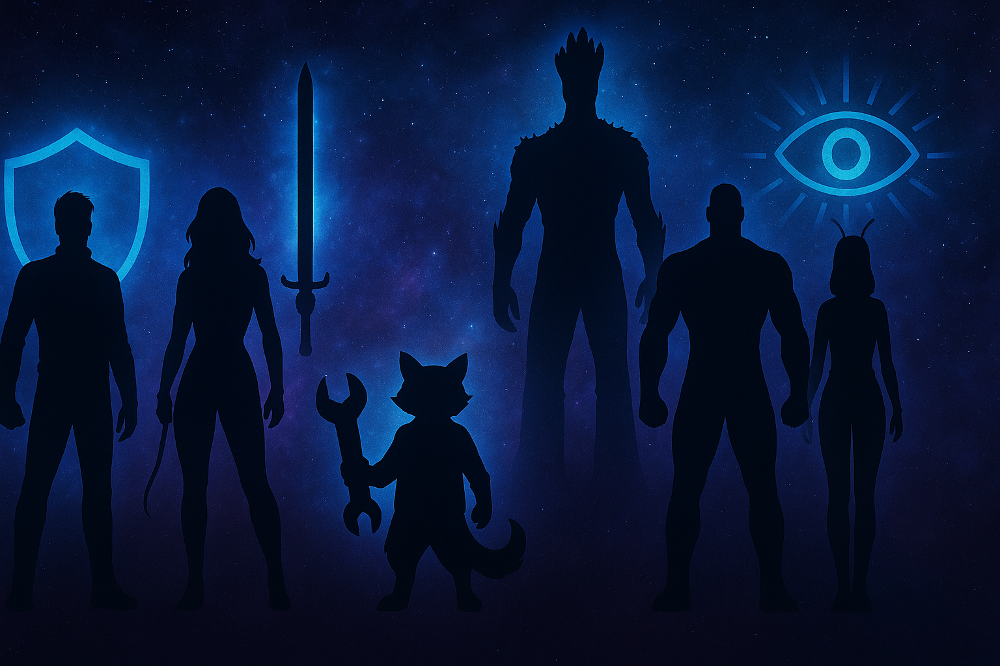

---


## Chris Ayers

### Principal Software Engineer<br>Azure CXP AzRel<br>Microsoft

<i class="fa-brands fa-bluesky"></i> BlueSky: [@chris-ayers.com](https://bsky.app/profile/chris-ayers.com)
<i class="fa-brands fa-linkedin"></i> LinkedIn: - [chris\-l\-ayers](https://linkedin.com/in/chris-l-ayers/)
<i class="fa fa-window-maximize"></i> Blog: [https://chris-ayers\.com/](https://chris-ayers.com/)
<i class="fa-brands fa-github"></i> GitHub: [Codebytes](https://github.com/codebytes)
<i class="fa-brands fa-mastodon"></i> Mastodon: [@Chrisayers@hachyderm.io](https://hachyderm.io/@Chrisayers)
~~<i class="fa-brands fa-twitter"></i> Twitter: @Chris_L_Ayers~~

---

## Container Security: The Challenge

**Modern Container Threats:**
- Supply Chain Attacks (xz-utils, LiteLLM, Axios)
- Runtime Exploits (Cryptojacking, Container Escape)
- Lateral Movement (Flat Networks)
- Visibility Gaps (Lack of Observability)

---

## Container Security: The Impact

**The Numbers:**
- 78% of orgs fail audits due to unresolved container CVEs
- 63% of organizations hit by supply chain attacks (2024-2025)
- 267 days average dwell time without runtime detection

---

## The Container Attack Kill Chain

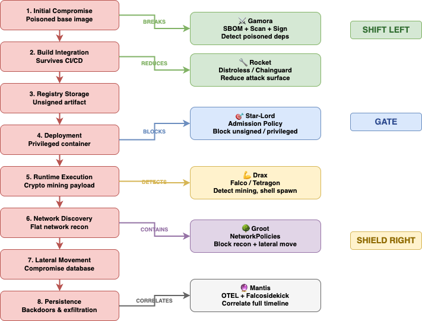

---

## The Guardians Framework

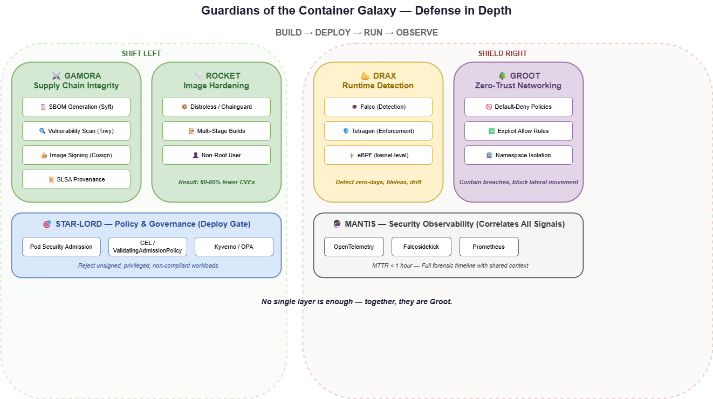

---

## Why Layering Matters

**No single control is perfect** → Layer them (Swiss cheese model)

**Log4Shell (CVE-2021-44228) proved it:**

| Layer | Response |
|-------|----------|
| **Scanning** | Found vulnerable Log4j in images |
| **Runtime** | Detected JNDI exploitation attempts |
| **Network** | Blocked C2 communication |
| **Observability** | Correlated timeline, full reconstruction |

**Different layers fail differently — overlapping controls matter**

---

## Shift Left + Shield Right

**Shift Left** = Prevent known bad (build-time)
- SBOM, vulnerability scanning, image signing
- Goal: catch 80% before deploy

**Shield Right** = Detect & contain what gets through (runtime)
- Behavioral detection, network policies, observability
- Why: 267 days average dwell time without runtime detection

**Both required.** Prevention alone is not enough.

---

## Principles We'll Apply Throughout

**Zero Trust:** Never trust, always verify — even inside the cluster *(→ Groot)*
**Supply Chain Security:** You don't control your dependencies — verify them *(→ Gamora)*
**Security Observability:** Siloed tools miss correlated attacks *(→ Mantis)*

**Standard:** NIST SP 800-207 &nbsp;|&nbsp; **Framework:** SLSA (OpenSSF)

**Our tools:** CNCF-first — portable, community-driven, production-proven
- **Graduated:** Falco, OPA, Cilium, Prometheus, Kyverno, OpenTelemetry
- **Incubating:** Trivy, Sigstore

---

<!-- _class: lead -->
# Guardian #1
## 🎯 Star-Lord
### Policy Orchestration

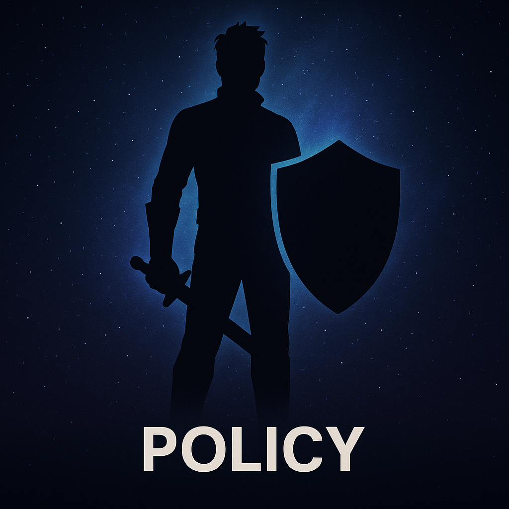

---

## Star-Lord: Admission Control

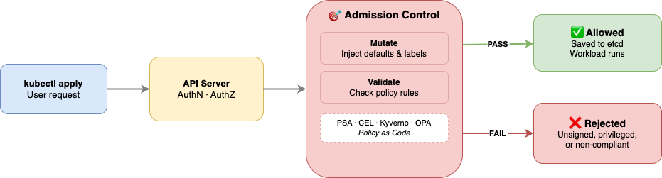

---

## Star-Lord: Policy as Code

**Choose the simplest enforcement layer that solves the problem:**

| Layer | When to Use |
|-------|-------------|
| **Pod Security Admission (PSA)** | Baseline pod hardening — fastest built-in guardrail |
| **ValidatingAdmissionPolicy (CEL)** | Simple custom validation — native, in-process (K8s v1.30+) |
| **Kyverno / OPA Gatekeeper** | Advanced policies — mutation, reporting, external data |

**All Policy as Code:** version controlled, peer reviewed, auditable

---

## Star-Lord: Image & Pod Policy Patterns

**Image Trust:**
- Require signed images (verify with Cosign)
- Block images from untrusted registries
- Deny `:latest` tag (enforce immutable tags)

**Pod Hardening:**
- Require non-root user
- Disallow privileged containers
- Drop all Linux capabilities by default

---

## Star-Lord: Runtime & Governance Patterns

**Runtime Boundaries:**
- Block hostPath, hostNetwork, hostPID mounts
- Enforce read-only root filesystem
- Prevent privilege escalation

**Operational Governance:**
- Require resource limits (CPU, memory)
- Enforce required labels (team, cost-center)
- Restrict allowed namespaces / service accounts

---

## Demo #1: Star-Lord
### Policy Enforcement with Kyverno

**What We'll Show:**

1. Deploy Kyverno admission controller
2. Apply policy: Require signed images + non-root
3. Try unsigned image → ❌ **Blocked**
4. Try root container → ❌ **Denied**
5. Deploy compliant workload → ✅ **Success**

<!-- Star-Lord decides what may enter. Next: Gamora verifies what enters is trustworthy. -->

---

<!-- _class: lead -->
# Guardian #2
## ⚔️ Gamora
### Supply Chain Integrity

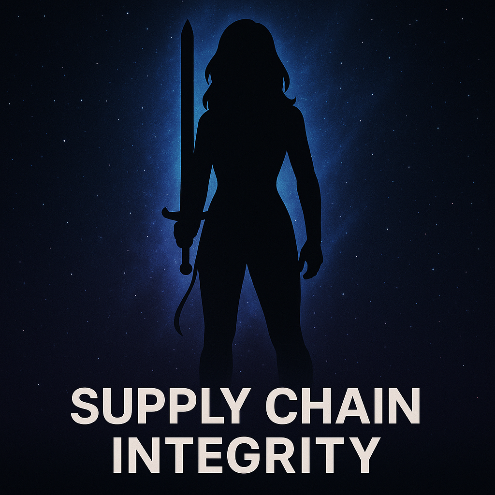

---

## Gamora: The Supply Chain Problem

**Trust is a vulnerability.** You don't control:
- Base images (Docker Hub, public registries)
- Transitive dependencies (your deps pull other deps)
- Build tools & CI infrastructure (can be compromised)

**Real-World Proof:**
- **xz-utils (2024):** Trusted maintainer planted SSH backdoor after 2 years
- **LiteLLM (2026):** Compromised security scanner → AI gateway backdoored on PyPI
- **Axios NPM (2026):** Hijacked account → RAT delivered to 100M+ weekly downloaders

---

## ⚔️ Gamora: Supply Chain Defense Pipeline

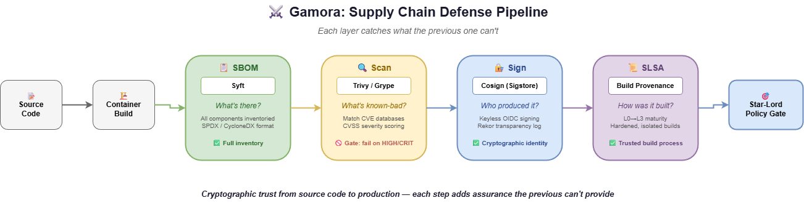

---

## Gamora: Vulnerability Scanning & Signing

**Vulnerability Scanning:**
- Match packages against CVE databases (NVD, OSV)
- Severity scoring (CVSS) — **Gate:** Fail builds on HIGH/CRITICAL
- Tools: Trivy, Grype, Snyk

**Cryptographic Signing:**
- Keyless with OIDC (no key management!)
- Sigstore: Cosign + Rekor + Fulcio
- **Verify:** Only signed images deploy

---

## Gamora: SLSA Framework

**Supply chain Levels for Software Artifacts (v1.0)**

- **Build L0:** No guarantees (status quo)
- **Build L1:** Build provenance exists
- **Build L2:** Hosted build platform (tamper-resistant)
- **Build L3:** Hardened build platform (isolated, auditable)

**Goal:** Move from L0 → L2+ for production

**Standard:** OpenSSF (Open Source Security Foundation)

---

## Demo #2: Gamora
### Complete Supply Chain Pipeline

**What We'll Show:**

1. Generate SBOM with Syft → See all packages
2. Scan image with Trivy → Find CVEs
3. Sign with Cosign → Keyless OIDC signature
4. Verify signature → Cryptographic proof
5. Deploy with policy → Only signed allowed

**Key Takeaway:** Cryptographic trust from build to deploy

---

<!-- _class: lead -->
# Guardian #3
## 🔧 Rocket
### Image Hardening

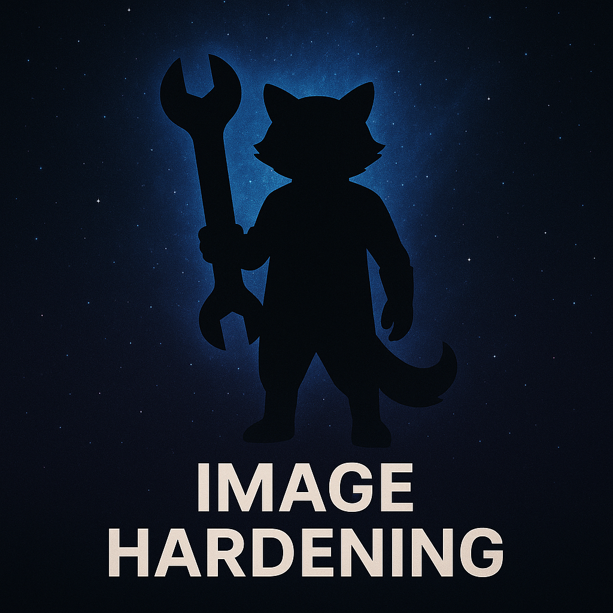

---

## Rocket: Before & After

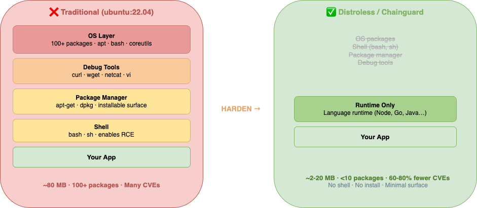

---

## Rocket: Distroless Philosophy

**What is Distroless?**

- **Only runtime dependencies** (language runtime + your app)
- **No shell** (bash, sh) → Can't RCE via shell injection
- **No package manager** → Can't install malware
- **No OS utilities** → Minimal attack surface

---

## Rocket: Distroless by the Numbers

**Numbers:**
- Ubuntu base: ~80MB, 100+ packages
- Distroless: ~2-20MB, <10 packages
- **Result:** 60-80% fewer CVEs

**Modern Options:**
- **Google Distroless** (Debian-based, Bazel builds)
- **Chainguard Images / Wolfi** (2,000+ images, nightly rebuilds, built-in SBOMs, near-zero CVEs)

---

## Rocket: Multi-Stage Builds

**Separate Build and Runtime:**

```dockerfile
# Stage 1: Build (has compilers, tools)
FROM python:3.11-slim AS build
WORKDIR /app
COPY requirements.txt ./
RUN pip install --no-cache-dir -r requirements.txt

# Stage 2: Runtime (minimal)
FROM gcr.io/distroless/python3-debian12
COPY --from=build /usr/local/lib/python3.11/site-packages \
     /usr/local/lib/python3.11/site-packages
COPY --from=build /app /app
USER nonroot:nonroot
ENTRYPOINT ["python", "/app/main.py"]
```

**Build tools never reach production**

---

## Demo #3: Rocket
### Image Hardening Before/After

**What We'll Show:**

1. Scan "before" (python:3.11-bullseye) → Count CVEs
2. Scan "after" (distroless python3-debian12) → Count CVEs
3. Compare: **60-80% reduction**
4. Compare sizes: **50%+ smaller**
5. Show: No shell in distroless container

**Key Takeaway:** Minimal base = minimal risk

<!-- Rocket ships a cleaner target. But once running, what is the container doing? -->

---

<!-- _class: lead -->
# Guardian #4
## 💪 Drax
### Runtime Detection

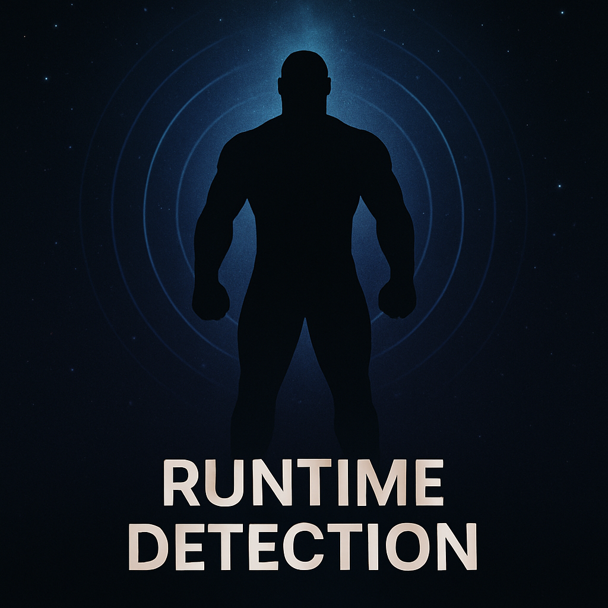

---

## Drax: Why Runtime Detection?

**Build-time scanning can't detect:**

- **Zero-day exploits** → No CVE exists yet
- **Fileless attacks** → Malware in memory only
- **Living-off-the-land** → Abuse curl, bash, legitimate tools
- **Insider threats** → Authorized malicious actions
- **Configuration drift** → Runtime container changes

**Remember that 267-day dwell time?** Runtime detection is how you shrink it.

**You need eyes on running containers**

---

## Drax: eBPF Technology

**Extended Berkeley Packet Filter**

**What is eBPF?**
- Kernel-level syscall monitoring
- Verified safe by kernel (can't crash system)
- JIT compiled (near-native performance <1% overhead)
- Event-driven (zero cost when idle)
- **Can't be bypassed** by userspace malware

**Used by:** Cilium, Falco, Tetragon, Pixie, Hubble

**Industry consensus:** eBPF is the future of observability

---

## Drax: Detection vs. Enforcement

**Falco** (CNCF Graduated) → **Detection** (alert on suspicious behavior)

**Tetragon** (part of Cilium) → **Enforcement** (kill processes, block syscalls in-kernel)

Use Falco for broad behavioral monitoring + alerting
Use Tetragon when you need real-time kernel-level blocking

---

## Drax: Detection Architecture

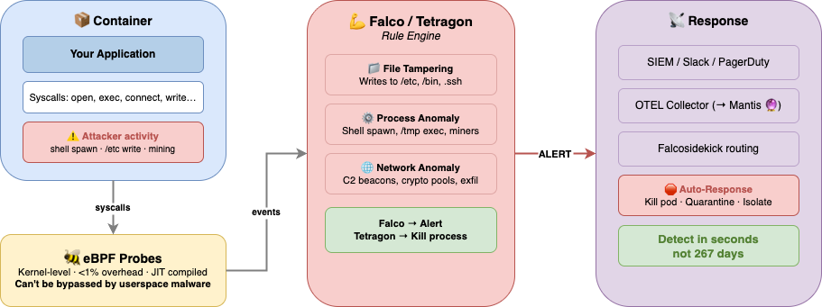

---

## Demo #4: Drax
### Runtime Detection with Falco

**What We'll Show:**

1. Deploy Falco with modern eBPF
2. Apply custom rule: Detect /etc writes
3. Monitor Falco logs real-time
4. Trigger: Pod writes /etc/shadow, /etc/passwd
5. Observe: Alerts with pod, file, user context

**Key Takeaway:** Detect malicious behavior instantly

<!-- Drax detects the threat. Groot limits where it can go. -->

---

<!-- _class: lead -->
# Guardian #5
## 🌳 Groot
### Zero-Trust Networking

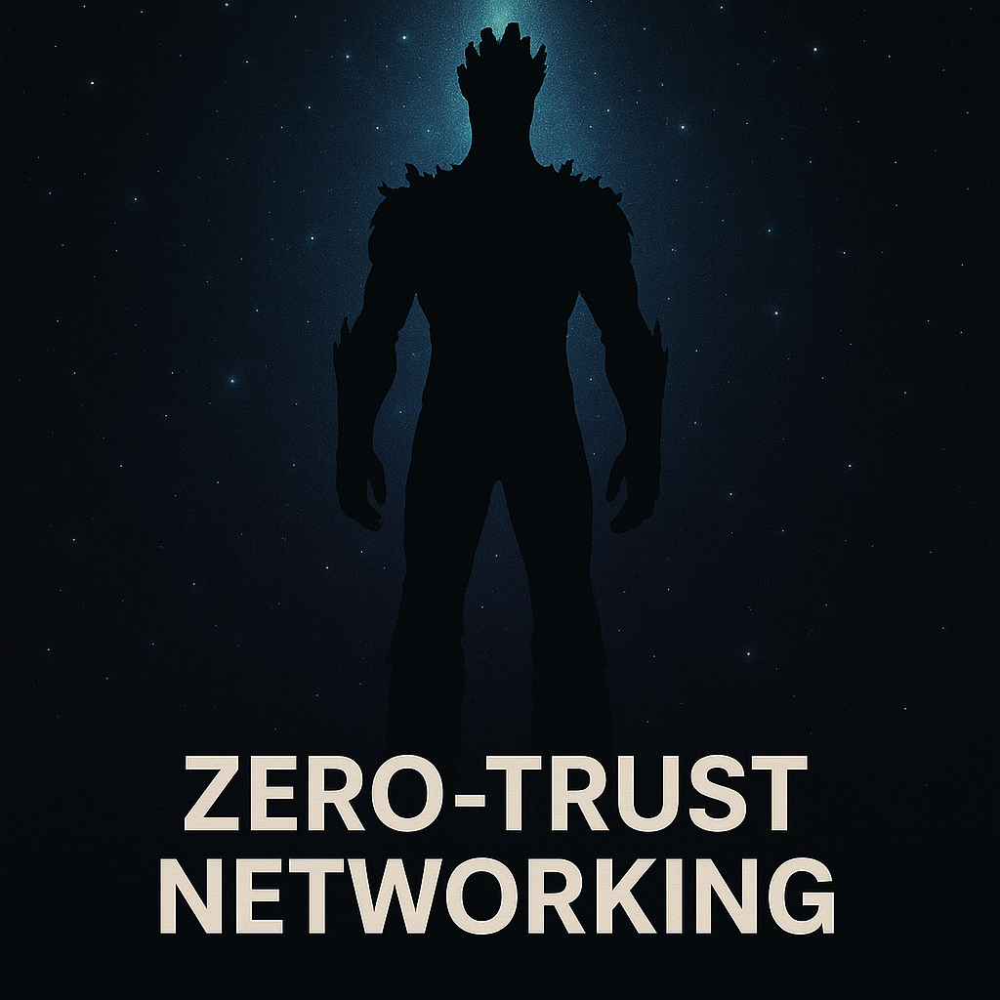

---

## Groot: The Lateral Movement Problem

**Kubernetes Default: Flat Network**

- Any pod can reach any other pod
- No network boundaries between namespaces
- Attacker compromises frontend → pivots to database
- Single vulnerability = full cluster access

**Real Attack:** Capital One breach (2019)
- SSRF in web app → AWS metadata service
- Stolen credentials → S3 bucket access
- **Lesson:** Flat networks enable easy lateral movement

---

## Groot: Zero Trust in Kubernetes

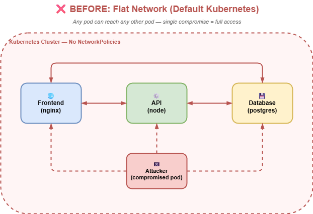

---

## Groot: Kubernetes NetworkPolicies

**How They Work — by example:**

- **Selector:** "This policy applies to pods labeled `app=api`"
- **Ingress:** "Only `app=frontend` can call the API"
- **Egress:** "API can only connect to `app=database`"
- **Namespace:** "Nothing in `dev` can reach `prod`"

**CNI Plugin Required:** Calico, Cilium (Docker Desktop doesn't support!)

**Beyond L3/L4:** Service mesh (Istio, Linkerd) adds mTLS + L7 identity

---

## Demo #5: Groot
### Zero-Trust Network Policies

**What We'll Show:**

1. Deploy 3-tier app (flat network)
2. Test: All pods can reach each other
3. Apply default-deny → All blocked
4. Test: Tester can't reach API/DB ✅
5. Apply allow rules → Only approved paths
6. Test: Frontend→API→DB works, rest blocked ✅

**Key Takeaway:** Contain breaches, prevent lateral movement

<!-- Groot limits where threats can go. Mantis shows you that they tried. -->

---

<!-- _class: lead -->
# Guardian #6
## 🔮 Mantis
### Security Observability


---

## Mantis: The Observability Gap

**Siloed Teams, Siloed Tools:**

**Without Correlation:**
- **Ops team:** "API is slow" (looks at Grafana)
- **Security team:** "No alerts" (checks SIEM)
- **Reality:** Crypto miner running for days

---

## Mantis: Correlation in Action

**With Correlation:**
- **9:00 AM:** API latency spike (APM)
- **9:02 AM:** High CPU usage (Prometheus)
- **9:02 AM:** Suspicious process (Falco alert)
- **Context:** Same pod, same trace ID
- **Result:** Detected in minutes, not days

---

## Mantis: Observability Correlation

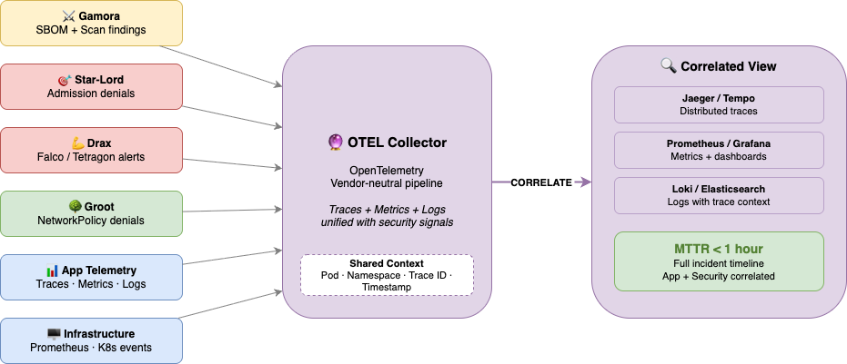


---

## Mantis: The Observability Context

**Common Context:**
- Pod name, namespace
- Trace ID (links requests across services)
- Timestamp (timeline reconstruction)

**Goal:** Mean Time To Respond (MTTR) < 1 hour

---

## Mantis: OpenTelemetry for Security

**Why OTEL Matters:**

**Traces:** Show which services were accessed during incident

**Metrics:** Detect resource anomalies (CPU spike = crypto miner)

**Logs:** Capture security-relevant events with context

**Vendor-Neutral:** Single instrumentation → any backend
- Jaeger, Prometheus, Grafana
- Datadog, New Relic, Splunk
- **No lock-in**

---

## Demo #6: Mantis
### Observability Correlation

**What We'll Show:**

1. Deploy OTEL collector + instrumented app
2. Deploy Falcosidekick → Route alerts to OTEL
3. Generate traffic → See traces in logs
4. (Optional) Trigger Falco → See security events alongside app traces
5. View timeline → App + security events

**Key Takeaway:** Link security to business impact

---

## Guardians Together: Prevent & Harden

**Scenario:** Cryptominer in compromised Node.js image

| Attack Step | Guardian | Action | Result |
|-------------|----------|--------|--------|
| Poisoned base image | ⚔️ Gamora | Scan + SBOM detects vuln | ⚠️ Known threats caught |
| Bloated surface | 🔧 Rocket | Distroless reduces tooling | ✅ Less to exploit |
| Unsigned deploy | 🎯 Star-Lord | Policy rejects image | ✅ Blocked at gate |

**Prevention catches what's known — but what gets through?**

---

## Guardians Together: Detect & Contain

**The attacker bypassed build-time controls…**

| Attack Step | Guardian | Action | Result |
|-------------|----------|--------|--------|
| Mining process spawns | 💪 Drax | Falco detects anomaly | ✅ Alert in seconds |
| C2 network beacon | 🌳 Groot | Egress policy blocks it | ✅ Contained |
| Full timeline needed | 🔮 Mantis | Correlates all signals | ✅ MTTR < 1 hour |

**Not every layer prevents — some reduce, some detect, some contain.**

---

## Container Security Maturity Model

| Level | Actions to Reach It |
|-------|---------------------|
| **0 → 1** | Image scanning in CI, Pod Security Admission (audit) |
| **1 → 2** | Image signing + verification, default-deny NetworkPolicies |
| **2 → 3** | Runtime detection (Falco), observability correlation, mTLS |
| **3 → 4** | Attestations, automated response, MTTR optimization |

---

## Your First Week

**Concrete Steps to Start Monday:**

🔍 **Day 1:** Run `trivy image` on your top 5 production images
📋 **Day 2:** Generate your first SBOM with `syft` → know your dependencies
🔒 **Day 3:** Apply `Restricted` Pod Security Standard to one namespace (audit mode)
🌐 **Day 4:** Apply default-deny NetworkPolicy to one namespace
👁️ **Day 5:** Deploy Falco in dry-run mode → see what it detects

**Don't boil the ocean: pick one namespace, one app, one pipeline.**

---

## Key Takeaways

1. **Defense in Depth** — No single tool is enough
2. **Shift Left + Shield Right** — Prevention AND detection required
3. **Principles First, Tools Second** — Pick controls you can actually run consistently
4. **Start Small** — One namespace, one pipeline, prove value, expand
5. **Measure Progress** — CVEs blocked, MTTR, coverage %

**"We are layered"** — Security is a team sport

---

## Questions?


---

# Resources & Links

<div class="columns">
<div>

- **Repo:** [github.com/codebytes/container-security](https://github.com/codebytes/container-security)
- **Slides:** [chris-ayers.com/container-security](https://chris-ayers.com/container-security)
- [NIST SP 800-207](https://csrc.nist.gov/publications/detail/sp/800-207/final)
- [SLSA Framework](https://slsa.dev/)
- [CIS Kubernetes Benchmark](https://www.cisecurity.org/benchmark/kubernetes)
- [CNCF Security TAG](https://github.com/cncf/tag-security)

</div>
<div>

<i class="fa-brands fa-bluesky"></i> BlueSky: [@chris-ayers.com](https://bsky.app/profile/chris-ayers.com)
<i class="fa-brands fa-linkedin"></i> LinkedIn: - [chris\-l\-ayers](https://linkedin.com/in/chris-l-ayers/)
<i class="fa fa-window-maximize"></i> Blog: [https://chris-ayers\.com/](https://chris-ayers.com/)
<i class="fa-brands fa-github"></i> GitHub: [Codebytes](https://github.com/codebytes)
<i class="fa-brands fa-mastodon"></i> Mastodon: [@Chrisayers@hachyderm.io](https://hachyderm.io/@Chrisayers)

</div>
</div>