<!-- TITLE SLIDE -->
# **Guardians of the Container Galaxy**
## Defending the Cosmic Cluster

### Chris Ayers
#### Senior Software Engineer - Microsoft


---


## Chris Ayers
### Senior Software Engineer - Microsoft

<i class="fa-brands fa-twitter"></i> Twitter: @Chris\_L\_Ayers
<i class="fa-brands fa-mastodon"></i> Mastodon: @Chrisayers@hachyderm.io
<i class="fa-brands fa-linkedin"></i> LinkedIn: chris-l-ayers
<i class="fa-brands fa-windows"></i> Blog: [chris-ayers.com](https://chris-ayers.com/)
<i class="fa-brands fa-github"></i> GitHub: [codebytes](https://github.com/codebytes)

---

## Container Security: The Challenge

**Modern Container Threats:**
- **Supply Chain Attacks** (SolarWinds, Codecov, 3CX)
- **Runtime Exploits** (Cryptojacking, Container Escape)
- **Lateral Movement** (Flat Networks)
- **Visibility Gaps** (Lack of Observability)

**The Numbers:**
- 51% of Docker Hub images contain HIGH/CRITICAL CVEs
- 742% increase in supply chain attacks (2019-2022)
- 200+ days average dwell time without runtime detection

---

## The Goal: Defense in Depth

Apply a **layered, CNCF-based security framework** across:

**Build** → **Deploy** → **Run** → **Observe**

**Strategy:** Shift Left + Shield Right

- **Shift Left:** SBOM, scanning, signing in CI/CD
- **Shield Right:** Runtime detection, network segmentation

**Result:** Earlier detection → smaller blast radius

---

## The Container Attack Kill Chain

**8-Step Attack Progression:**

1. **Initial Compromise** → Poisoned base image
2. **Build Integration** → Survives CI/CD (no scanning)
3. **Registry Storage** → Unsigned artifact (no verification)
4. **Deployment** → Privileged container (weak policies)
5. **Runtime Execution** → Crypto mining payload
6. **Network Discovery** → Flat network recon
7. **Lateral Movement** → Compromise database service
8. **Persistence** → Backdoors & data exfiltration

**Key Insight:** Breaches exploit **chained weaknesses** across the lifecycle

---

## Our Approach: The Guardians Framework

**6 Security Layers** mapped to Guardians of the Galaxy characters

Each Guardian represents a critical defensive control:

- **Star-Lord** → Policy & Governance
- **Gamora** → Supply Chain Integrity
- **Rocket** → Image Hardening
- **Drax** → Runtime Detection
- **Groot** → Network Segmentation
- **Mantis** → Observability

**Why this metaphor?** Memorable, relatable, team-based defense

---

## Meet the Guardians

**Star-Lord** → Policy Orchestration
**Gamora** → Supply Chain Integrity
**Rocket** → Image Hardening
**Drax** → Runtime Detection
**Groot** → Network Segmentation
**Mantis** → Observability

---

## Security Foundations: Core Concepts

**Before diving into tools, understand the principles**

---

## Foundation 1: Defense in Depth

**No single control is perfect**

**Layer security controls:**
- Build-time: Scan for known vulnerabilities
- Deploy-time: Verify signatures, enforce policies
- Runtime: Detect anomalous behavior
- Network: Segment and control traffic

**Attacker must breach multiple layers**

**Example:** Missed CVE at build → caught by runtime detection → contained by network policy

---

## Foundation 2: Shift Left + Shield Right

**Shift Left (Build-time):**
- Find vulnerabilities early (cheaper to fix)
- SBOM, scanning, signing in CI/CD
- Policy enforcement before deployment

**Shield Right (Runtime):**
- Detect threats that bypass build controls
- Zero-day exploits, insider threats
- Behavioral monitoring, network segmentation

**Both Required:** Left catches known issues, Right catches unknowns

---

## Foundation 3: Zero Trust Architecture

**Never trust, always verify**

**Apply to containers:**
- **Workload identity** (not network location)
- **Least privilege** (minimal permissions)
- **Continuous verification** (every request authenticated)
- **Assume breach** (segment to limit blast radius)

**Implementation:** Signed images + admission control + network policies + runtime detection

---

## Foundation 4: Supply Chain Security

**Trust is a vulnerability**

**Protect the pipeline:**
- **Know what you're running** (SBOM)
- **Verify origin** (cryptographic signatures)
- **Detect tampering** (image digests, attestations)
- **Transparency** (public logs for accountability)

**Standard:** SLSA framework (levels 0-4)

---

## Foundation 5: Observability for Security

**You can't secure what you can't see**

**Security observability:**
- **Correlation** (link security events to business impact)
- **Context** (pod, namespace, trace ID)
- **Timeline** (reconstruct incidents)
- **Metrics** (measure security posture over time)

**Goal:** MTTR (Mean Time To Respond) < 1 hour

---

## CNCF Landscape for Container Security

**Cloud Native Computing Foundation = Vendor-Neutral Innovation**

---

## Why CNCF Projects?

✅ **No vendor lock-in** (community-driven, open governance)
✅ **Portability** (works across clouds, on-prem)
✅ **Community support** (thousands of contributors)
✅ **Production-proven** (graduated projects battle-tested)
✅ **Composable** (designed to work together)
✅ **Transparent roadmap** (public planning)

**CNCF Maturity Levels:**
- **Graduated:** Production-ready (Falco, OPA, Cilium, Prometheus)
- **Incubating:** Rapidly maturing (Kyverno, OpenTelemetry, Sigstore)
- **Sandbox:** Early innovation (Trivy, Tetragon, others)

---

## CNCF Security TAG (Technical Advisory Group)

**Security TAG Mission:**
- Define cloud-native security principles
- Evaluate project security posture
- Publish security best practices
- Maintain security tooling landscape

**Key Outputs:**
- Cloud Native Security Whitepaper
- Software Supply Chain Best Practices
- CNCF Security Assessments (all graduated projects)

**Source:** github.com/cncf/tag-security

---

## Star-Lord: The Leader
### Policy Orchestration

> "Someone has to keep the team aligned"

**Tools:** OPA, Kyverno
**Superpower:** Orchestrates security guardrails across the entire cluster
**Role:** Admission controls & governance

---

## Gamora: The Assassin
### Supply Chain Integrity

> "I don't trust anyone, especially unsigned artifacts"

**Tools:** Trivy, Syft, Cosign
**Superpower:** Precisely eliminates threats before they enter your cosmos
**Role:** SBOM, scanning, signing

---

## Rocket: The Engineer
### Image Hardening

> "Ain't nothing like a good, secure container"

**Tools:** Grype, Dockle, Distroless
**Superpower:** Engineers impossibly tight, minimal attack surfaces
**Role:** Minimalism & vulnerability reduction

---

## Drax: The Destroyer
### Runtime Detection

> "Nothing goes over my head. My reflexes are too fast."

**Tools:** Falco, eBPF
**Superpower:** Relentlessly hunts down suspicious runtime behavior
**Role:** Behavioral monitoring

---

## Groot: The Guardian
### Network Segmentation

> "I am Groot" (Translation: "We are isolated")

**Tools:** Calico, Cilium, NetworkPolicies
**Superpower:** His roots create impenetrable network barriers
**Role:** Network policies & isolation

---

## Mantis: The Empath
### Observability

> "I sense something... anomalous"

**Tools:** OpenTelemetry, Prometheus, Grafana
**Superpower:** Feels the subtle shifts in your security posture
**Role:** Security signal correlation

---

## Star-Lord: Policy Orchestration

### "Someone has to lead the team"

---

## Policy Orchestration Goal

Enforce **consistent, automated guardrails**

**Early** (admission) & **Continuously** (runtime)

---

## Key Concept: Admission Control

**Prevent non-compliant workloads:**
- Unsigned images
- Root users
- Missing labels
- Excessive privileges

**Before they enter the cluster**

**Mechanism:** Kubernetes Dynamic Admission Controllers (Validating/Mutating Webhooks)

---

## Security Concept: Policy-as-Code

**Version control security requirements:**
- Git-tracked policy definitions
- Peer review for policy changes
- Audit trail of modifications
- Rollback capabilities

**Benefits:** Consistent enforcement, collaborative governance, compliance evidence

---

## Key Concept: Declarative Governance

**Policies as code:**
- Versioned in Git
- Peer reviewed
- Rego / Kyverno CRDs

**Policy Engines:**
- **OPA/Gatekeeper:** Rego language, general-purpose
- **Kyverno:** Kubernetes-native, YAML-based
- **Kubewarden:** Rust/WASM policies

---

## Policy Engine Options

### CNCF Projects

**OPA + Gatekeeper** (Graduated)
- General-purpose policy engine
- Rego query language
- Multi-cloud support
- **Use Case:** Complex logic, multiple platforms

**Kyverno** (Incubating)
- Kubernetes-native policies
- No new language to learn
- Generate, validate, mutate
- **Use Case:** K8s-only, easy adoption

---

## Policy Engine Comparison

| Feature | OPA/Gatekeeper | Kyverno |
|---------|----------------|---------|
| **Language** | Rego (learning curve) | YAML (familiar) |
| **Scope** | Multi-platform | Kubernetes-native |
| **Mutations** | Limited | Extensive |
| **Policy Generation** | No | Yes (auto-create resources) |
| **Community** | Large, mature | Growing rapidly |

**Decision Criteria:** Team expertise, multi-cloud needs, policy complexity

---

## Cloud Provider Options

**AWS:** Amazon EKS with Pod Security Standards, IAM Roles for Service Accounts (IRSA)

**Azure:** Azure Policy for AKS, Azure AD Workload Identity

**GCP:** Binary Authorization, Workload Identity, Policy Controller (Anthos)

**Trade-off:** Vendor lock-in vs. native integration & support

---

## Key Concept: Shift-Left Continuity

**Same policy logic:**
- CI (OPA evaluation)
- Cluster (Gatekeeper/Kyverno)

**One source of truth**

**Tools:** conftest (OPA), kyverno CLI

---

## Common Pitfalls

❌ Overly broad exceptions erode trust

❌ Silent policy failures reduce adoption

❌ No audit/deny mode testing before enforcement

❌ Policies block legitimate workloads (developer friction)

---

## Success Metrics

📊 % blocked non-compliant deployments

⚡ Policy evaluation latency

🔧 Mean time to policy remediation

📋 Policy coverage % (workloads under governance)

---

## Why Kyverno for Demo 1?

**Decision Rationale:**

✅ **CNCF Incubating** (production-ready, growing adoption)
✅ **Kubernetes-native** (no new language to learn)
✅ **YAML policies** (familiar to K8s users)
✅ **Rich features** (validate, mutate, generate)
✅ **Active community** (frequent updates, good docs)

**Alternative Considered:** OPA/Gatekeeper
- **Pros:** More mature (Graduated), broader use cases
- **Cons:** Rego learning curve, more complex for K8s-only use

**Demo Goal:** Show easiest path to admission control

---

## Star-Lord Demo Objectives

**Enforce signed images + non-root**
Using real Kyverno policies

---

## Demo Step 1: Install Kyverno

```bash
helm upgrade --install kyverno kyverno/kyverno \
  -n kyverno --create-namespace
```

---

## Demo Step 2: Apply Policy

```bash
kubectl apply -f policies/require-signed-nonroot.yaml
```

---

## Demo Step 3: Test Unsigned Image

```bash
kubectl apply -f manifests/unsigned-pod.yaml
```

**Expected:** ❌ Admission failure

---

## Demo Step 4: Sign & Deploy

```bash
cosign sign --yes ghcr.io/codebytes/demo:latest
# Then redeploy
```

**Expected:** ✅ Success

---

## Demo Step 5: Test Root Container

```bash
kubectl apply -f manifests/root-pod.yaml
```

**Expected:** ❌ Denial

---

## Success Criteria

✅ Policy blocks unsigned images

✅ Policy blocks root containers

✅ Policy allows compliant workloads

---

## Gamora: Supply Chain Integrity

### "I don't trust anyone, especially artifacts"

---

## Supply Chain Threats

**Dependency poisoning** (typosquatting, compromised packages)
**Base image drift** (upstream CVEs)
**Tampered layers** (MITM attacks)
**Hidden malware** (embedded backdoors)
**Manifest substitution** (registry compromise)

**Real Example:** SolarWinds (2020), Codecov (2021), 3CX (2023)

---

## Security Concept: Software Bill of Materials (SBOM)

**Inventory of all components:**
- Direct dependencies
- Transitive dependencies
- Operating system packages
- File digests

**Standards:** SPDX, CycloneDX

**Value:** Vulnerability correlation, license compliance, supply chain transparency

---

## Security Concept: Cryptographic Signing

**Non-repudiation:** Prove artifact origin

**Integrity:** Detect tampering

**Keyless Signing:** OIDC identity (no key management burden)

**Standard:** Sigstore (CNCF project)

---

## Supply Chain Controls: Build Stage

**SBOM Generation** → Syft, Trivy
**Vulnerability Scanning** → Trivy / Grype
**SAST/Secret Scanning** → GitGuardian, TruffleHog

---

## Supply Chain Controls: Artifact Stage

**Signing & Attestations** → Cosign, Notation
**Provenance Recording** → SLSA attestations

---

## Supply Chain Controls: Admission Stage

**Policy Gate** → OPA / Kyverno
**Signature Verification** → Verify before deploy

---

## Supply Chain Controls: Runtime Stage

**Continuous Rescan** → Trivy Operator
**Dependency Drift Detection** → Compare SBOM vs running

---

## SBOM & Scanning Tool Options

### CNCF/Linux Foundation Projects

**Trivy** (Aqua Security, CNCF)
- Comprehensive scanner (OS, languages, IaC)
- **Use Case:** All-in-one solution

**Grype** (Anchore)
- Vulnerability scanner with accuracy focus
- **Use Case:** CI/CD integration

**Syft** (Anchore)
- SBOM generation
- **Use Case:** Inventory creation

**Trivy vs Grype:** Trivy broader scope, Grype more focused accuracy

---

## Signing & Attestation Options

### CNCF/Linux Foundation

**Sigstore** (CNCF Incubating)
- **Cosign:** Container image signing
- **Rekor:** Transparency log
- **Fulcio:** Certificate authority (keyless)
- **Use Case:** Modern, keyless signing

**Notary v2 / Notation** (CNCF)
- OCI artifact signing standard
- Multi-registry support
- **Use Case:** OCI standard compliance

**Cloud Options:**
- **AWS:** Signer, ECR immutability tags
- **Azure:** Content Trust, Azure Container Registry signing
- **GCP:** Binary Authorization, Artifact Registry

---

## Design Principle: Immutable Provenance

**Cryptographic signatures + attestations**

Know exactly what you're running

**SLSA Framework:** Supply chain Levels for Software Artifacts (Google)
- Level 0: No guarantees
- Level 1: Build provenance
- Level 2: Signed provenance
- Level 3: Hardened build platform
- Level 4: Two-party review

---

## Design Principle: Minimum Base

**Smaller attack surface** → **Fewer CVEs**

**Base Image Options:**
- **Distroless** (Google): No shell, minimal packages
- **Alpine**: Small footprint, musl libc
- **Chainguard Images**: Minimal, daily rebuilds, free & enterprise
- **Wolfi**: Linux undistro for containers

**Trade-off:** Size vs compatibility vs maintainability

---

## Design Principle: Fail Fast

**Break pipeline on critical vulnerabilities**

Don't ship the problem

**Policy Examples:**
- Block CRITICAL severity
- Block HIGH with exploit available
- Block critical packages (e.g., Log4Shell)

**Exception Handling:** Risk acceptance workflow with approval

---

## Problem Symptoms

❌ Inherited CVEs
❌ Opaque dependencies  
❌ Tampered images
❌ Build/deploy drift

---

## Business Risks

💥 Silent compromise
💥 Cascading rebuilds
💥 Provenance uncertainty

---

## SBOM & Scanning Flow


---

## Complete Workflow: Step 1-2

**1. Generate SBOM**
```bash
syft packages $IMAGE -o json > sbom.json
```

**2. Vulnerability Scan**
```bash
trivy image --exit-code 1 --severity HIGH,CRITICAL $IMAGE
```

---

## Complete Workflow: Step 3-4

**3. Keyless Signing**
```bash
cosign sign --yes $IMAGE
```

**4. Attestation Storage**
Cosign stores signatures + SBOM in registry

---

## Complete Workflow: Step 5-6

**5. Admission Policy**
Kyverno `verifyImages` checks signatures

**6. Continuous Monitoring** 
Scheduled rescans detect new CVEs

---

## Demo Commands

```bash
export IMAGE="ghcr.io/codebytes/guardian-demo:latest"
syft packages $IMAGE -o json | tee sbom.json
trivy image --severity HIGH,CRITICAL $IMAGE
cosign sign --yes $IMAGE
```

---

## Verification Command

```bash
cosign verify $IMAGE \
  --certificate-identity-regexp='.*' \
  --certificate-oidc-issuer='https://token.actions.githubusercontent.com'
```

---

## Supply Chain Checklist

☐ **SBOM in build output** (Syft JSON)
☐ **Vulnerability gating** (Fail ≥ High CVSS)
☐ **Image signing** (Cosign keyless OIDC)
☐ **Signature verification** (Reject unsigned)
☐ **Base image drift monitoring** (Trivy cron)

---

## Security Foundation: Supply Chain Attacks

**Real-World Attack Vectors:**

1. **Dependency Confusion** (2021): Malicious packages with same name as internal
2. **Codecov Bash Uploader** (2021): Compromised upload script stole credentials
3. **SolarWinds** (2020): Trojanized build system infected updates
4. **Event-Stream NPM** (2018): Maintainer added Bitcoin-stealing code

**Common Thread:** Trust without verification

**Defense:** Cryptographic verification + transparency

---

## Security Foundation: Supply Chain Security Principles

### 1. **Provenance Tracking**
Know exactly what's in your container and where it came from

### 2. **Immutable Attestations**
Cryptographically signed metadata that can't be tampered with

### 3. **Transparency Logs**
Public, auditable record of all signatures (non-repudiation)

### 4. **Continuous Verification**
Don't trust once - verify at build, deploy, and runtime

**Framework:** SLSA (Supply chain Levels for Software Artifacts) by Google/OpenSSF

---

## Why Trivy + Syft + Cosign for Demo 2?

**TRIVY (Aqua Security - CNCF Sandbox)**

✅ **All-in-one scanner** (OS, languages, IaC, secrets, config)
✅ **Fast** (optimized CVE database)
✅ **Easy to use** (single binary, great defaults)
✅ **CI/CD friendly** (JSON output, exit codes)

**SYFT (Anchore - Open Source)**

✅ **Best-in-class SBOM** (SPDX, CycloneDX support)
✅ **Deep package detection** (language-specific parsers)
✅ **Composable** (works with Grype for scanning)

**COSIGN (Sigstore - CNCF Incubating)**

✅ **Keyless signing** (no key management!)
✅ **OIDC integration** (GitHub Actions, GitLab CI)
✅ **Transparency log** (Rekor for non-repudiation)
✅ **Industry standard** (part of Sigstore ecosystem)

---

## Why These Tools? (continued)

**Alternative: Grype (Anchore)**
- More focused on vulnerability accuracy
- Better for organizations with low false-positive tolerance
- **Why Not Demo:** Trivy's breadth (IaC, secrets) shows more value

**Alternative: Docker Scout (Docker Inc.)**
- Integrated with Docker tooling
- Great for Docker-first workflows
- **Why Not Demo:** Less portable, commercial product

**Demo Goal:** Show complete CNCF-based supply chain with minimal tools

---

## Demo Scenario

**Complete pipeline from source to secure deployment**

---

## Build Pipeline: Steps 1-3

**1. Build**
```bash
docker build -f pipeline/Dockerfile -t ghcr.io/codebytes/guardian-demo:v0.1.0
```

**2. SBOM Generation**
```bash
syft packages [image] -o json > attestations/sbom.json
```

**3. Vulnerability Scan**
```bash
trivy image --exit-code 1 --severity HIGH,CRITICAL [image]
```

---

## Build Pipeline: Steps 4-5

**4. Sign**
```bash
cosign sign --yes [image]
```

**5. Push**
```bash
docker push [image]
```

---

## Deployment Tests: Steps 6-8

**6. Apply Policy**
```bash
kubectl apply -f manifests/policy-require-signature.yaml
```

**7. Test Unsigned** → ❌ Admission failure

**8. Test Signed** → ✅ Success

---

## Pipeline Automation

```bash
cd demos/supply-chain-trust/pipeline
export REGISTRY=ghcr.io/codebytes
make build sbom scan sign push
make verify
kubectl apply -f ../manifests/policy-require-signature.yaml
```

---

## Success KPIs

📊 **SBOM coverage %**
📊 **Vulnerability gate effectiveness** 
📊 **Signature verification rate**

---

## Rocket: Image Hardening

### "Ain't nothing like a good, secure container"

---

## Image Hardening Objectives

**Reduce attack surface** (fewer components = fewer vulnerabilities)
**Reduce privilege** (limit blast radius)
**Reduce vulnerability churn** (stable base images)

**Goal:** Minimal, immutable, non-privileged containers

---

## Security Concept: Attack Surface Reduction

**Every package is a potential vulnerability:**
- OS utilities (curl, wget, bash)
- Development tools (gcc, make)
- Debugging tools (gdb, strace)

**Minimize installed software:**
- Only include runtime dependencies
- Remove package managers
- Use distroless/scratch bases

---

## Security Concept: Least Privilege

**Containers should NOT:**
- Run as root (uid 0)
- Have unnecessary Linux capabilities
- Write to filesystem (immutable)
- Access host resources

**Security Context Controls:**
- `runAsNonRoot: true`
- `readOnlyRootFilesystem: true`
- `allowPrivilegeEscalation: false`
- `seccompProfile`, `appArmorProfile`

---

## Hardening Practices: Base Images

✅ **Minimal/Distroless base images**
✅ **Multi-stage builds** (remove compilers)
✅ **Pin explicit versions + digests**
✅ **Scan base images before use**
✅ **Rebuild on base image updates**

**Anti-pattern:** `FROM ubuntu:latest` (unpredictable, bloated)

---

## Base Image Options

**Distroless** (Google)
- No shell, no package manager
- ~2MB for static binaries
- **Pros:** Minimal attack surface
- **Cons:** Harder to debug

**Alpine Linux**
- ~5MB base image
- `apk` package manager
- **Pros:** Small, popular
- **Cons:** musl libc compatibility issues

**Chainguard Images**
- Wolfi-based, SBOM included
- Daily rebuilds for CVE fixes
- **Pros:** Security-first design
- **Cons:** Newer ecosystem

**Scratch**
- Empty image (0MB)
- For static binaries only
- **Pros:** Ultimate minimal
- **Cons:** No utilities at all

---

## Multi-Stage Build Security

**Separate build and runtime stages:**

```dockerfile
# Build stage (has compilers, tools)
FROM golang:1.21 AS builder
WORKDIR /app
COPY . .
RUN go build -o myapp

# Runtime stage (minimal)
FROM gcr.io/distroless/static-debian12
COPY --from=builder /app/myapp /
USER nonroot:nonroot
ENTRYPOINT ["/myapp"]
```

**Benefits:** No build tools in production, smaller images, fewer CVEs

---

## Hardening Practices: Security

✅ **Non-root user** (avoid uid 0)
✅ **Drop Linux capabilities** (CAP_NET_RAW, CAP_SYS_ADMIN)
✅ **Read-only root filesystem** (immutable)
✅ **No privilege escalation** (prevent setuid)
✅ **Seccomp profiles** (restrict syscalls)
✅ **Resource limits** (prevent DoS)

---

## Linux Capabilities Explained

**Capabilities split root privileges into units:**
- `CAP_NET_BIND_SERVICE`: Bind ports <1024
- `CAP_SYS_ADMIN`: Administrative operations
- `CAP_NET_RAW`: Raw socket access

**Drop unnecessary capabilities:**
```yaml
securityContext:
  capabilities:
    drop: ["ALL"]
    add: ["NET_BIND_SERVICE"]
```

**Default Docker capabilities:** 14 (too many!)

---

## Attack Surface Equation

**Packages + Open Ports + Privileges**
=
**Exploit Opportunities**

**Example:**
- Ubuntu base: 100+ packages, root user = High risk
- Distroless: 5 packages, non-root user = Low risk

---

## Image Hardening Tools

**Dockle** (Goodwill)
- Dockerfile linter for security
- Checks best practices
- **Use Case:** CI/CD validation

**Trivy** (with image config checks)
- Scans for misconfigurations
- Checks security context

**Docker Scout** (Docker Inc.)
- Image analysis & recommendations
- SBOM generation

---

## Success Metrics

📏 **Image size delta** (before/after hardening)
🔍 **CVE count delta** (vulnerability reduction)
👤 **% containers running as root** (privilege tracking)
⏱️ **Mean time to patch base image** (update velocity)
🔒 **% images with read-only filesystem** (immutability)

---

## Security Foundation: Container Escape & Privilege Escalation

**Attack Scenarios:**

1. **CVE-2019-5736 (runc):** Container escape via runc vulnerability
2. **Dirty Pipe (CVE-2022-0847):** Write to read-only files → privilege escalation
3. **Root + Capability = Host Access:** Many CVEs require root + specific capabilities

**Defense Layers:**
- **Reduce packages** → Fewer vulnerable binaries
- **Non-root user** → Limit damage from exploit
- **Read-only filesystem** → Prevent malware persistence
- **Drop capabilities** → Remove privilege escalation paths

**Principle:** Defense in depth - multiple controls mitigate single-vulnerability impact

---

## Security Foundation: The Distroless Philosophy

**Traditional Base Image (ubuntu:22.04):**
```
- Package manager (apt): 10+ CVEs per year
- Shell (bash): Enables interactive attacks
- 100+ OS packages: Broad attack surface
- Debugging tools: Useful for attackers too
```

**Distroless Image:**
```
- No package manager: Can't install malware
- No shell: No RCE via shell injection
- Only runtime dependencies: Minimal attack surface
- Static user/group: Consistent security context
```

**Result:** 60-80% reduction in CVE count

**Source:** Google Distroless project (github.com/GoogleContainerTools/distroless)

---

## Why Distroless + Multi-Stage for Demo 3?

**DISTROLESS (Google - Open Source)**

✅ **Minimal attack surface** (~2MB vs 80MB Ubuntu)
✅ **No shell** (eliminates entire attack class)
✅ **Well-maintained** (Google production workloads)
✅ **Multiple variants** (static, base, Java, Python, Node)
✅ **Proven security** (used by Google, many Fortune 500)

**MULTI-STAGE BUILDS (Docker/OCI Standard)**

✅ **Separation of concerns** (build tools vs runtime)
✅ **Smaller images** (no compilers in production)
✅ **Standard practice** (built into Docker/Buildah/Kaniko)

**Alternative Considered: Alpine Linux**
- **Pros:** Small (5MB), package manager available
- **Cons:** musl libc compatibility issues, still has shell
- **Why Not Demo:** Distroless shows more dramatic CVE reduction

**Alternative Considered: Chainguard Images**
- **Pros:** Daily rebuilds, included SBOM, very secure
- **Cons:** Newer ecosystem, some commercial features
- **Why Not Demo:** Distroless is more widely known

**Demo Goal:** Show dramatic before/after security improvement

---

## Demo Plan

**Vulnerability reduction through:**
- Multi-stage builds
- Distroless base images

---

## Demo Step 1: Build Baseline

```bash
docker build -f dockerfiles/Dockerfile.before -t guardian-demo:before
```

---

## Demo Step 2: Scan Baseline

```bash
trivy image guardian-demo:before | tee reports/before.txt
```

---

## Demo Step 3: Build Hardened

```bash
docker build -f dockerfiles/Dockerfile.after -t guardian-demo:after
```

---

## Demo Step 4: Scan Hardened

```bash
trivy image guardian-demo:after | tee reports/after.txt
```

---

## Demo Step 5: Compare Results

```bash
echo "Before: $(grep -E 'HIGH|CRITICAL' before-scan.txt | wc -l) CVEs"
echo "After: $(grep -E 'HIGH|CRITICAL' after-scan.txt | wc -l) CVEs"
```

---

## Expected Results

🎯 **60-80% reduction** in HIGH/CRITICAL CVEs
🎯 **50%+ smaller** image size

---

## Drax: Runtime Detection

### "Nothing goes over my head. My reflexes are too fast."

---

## Runtime Detection Focus

**Syscalls via eBPF** → **Rules** → **Alerts**

**Target:** Privilege escalation, file tampering, network anomalies

**Why Runtime?** Build-time controls can't detect:
- Zero-day exploits
- Compromised dependencies activated at runtime
- Insider threats
- Container escape attempts

---

## Security Concept: Behavioral Detection

**Monitor what containers DO, not just what they ARE**

**Baseline Normal Behavior** → **Detect Deviations**

**Advantages over signature-based:**
- Catch unknown threats (zero-days)
- Detect anomalous patterns
- Context-aware (pod, namespace, labels)

---

## Security Concept: eBPF

**Extended Berkeley Packet Filter**

**Kernel-level observability without kernel modules:**
- Safe, sandboxed programs in kernel
- Minimal performance overhead (<1%)
- No kernel recompilation
- Event-driven execution

**Use Cases:** Networking, security, observability

---

## Core Concept: Data Source

**Syscalls (eBPF kernel hooks)**
- No performance impact
- Kernel-level visibility
- Real-time monitoring
- Can't be bypassed by malware

**Alternative:** `ptrace` (higher overhead), kernel modules (risky)

---

## Core Concept: Rule Engine

**Condition logic + output templates**
- Priority levels (EMERGENCY → DEBUG)
- Custom rules (YAML)
- Context-aware alerts (pod, namespace, image)
- Exception lists (reduce false positives)

**Rule Libraries:**
- Default rules (Falco community)
- Custom rules (organization-specific)
- Compliance rules (PCI DSS, HIPAA)

---

## Core Concept: Deployment

**DaemonSet on every node** (kernel visibility)
OR
**Userspace for containers** (no kernel access needed)

**Driver Options:**
- **eBPF** (legacy): Requires kernel 4.14+
- **modern_ebpf**: CO-RE, wider compatibility
- **kernel module**: Highest compatibility, requires privileges

---

## Core Concept: Integration

**Forward alerts to:**
- SIEM systems (Splunk, Elastic)
- Incident response (PagerDuty, Opsgenie)
- Chat ops (Slack, Teams)
- Automated response (kill pod, quarantine)

**Falcosidekick:** Alert router for 50+ outputs

---

## Runtime Detection Tool Options

### CNCF Projects

**Falco** (CNCF Graduated)
- De facto standard for container runtime security
- eBPF-based syscall monitoring
- Rich rule library
- **Use Case:** General-purpose runtime detection

**Tetragon** (CNCF, Cilium project)
- eBPF-based security observability
- Policy enforcement at kernel level
- Network + process visibility
- **Use Case:** Advanced filtering, enforcement

**Tracee** (Aqua Security)
- Runtime security and forensics
- eBPF-based event collection
- Signature-based threat detection
- **Use Case:** Threat intelligence integration

---

## Runtime Tool Comparison

| Feature | Falco | Tetragon | Tracee |
|---------|-------|----------|--------|
| **Maturity** | Graduated | Sandbox | Community |
| **Rules** | YAML conditions | Policy enforcement | Signatures |
| **Output** | Alerts | Logs + enforce | Events + detections |
| **Learning Curve** | Low | Medium | Medium |

**Decision Criteria:** Community support, policy enforcement needs, threat intel integration

---

## Cloud Provider Runtime Options

**AWS:**
- **GuardDuty for EKS**: Runtime threat detection
- **Runtime Monitoring**: Container-aware alerts

**Azure:**
- **Defender for Containers**: Behavioral threat detection
- **Azure Monitor**: Runtime insights

**GCP:**
- **Security Command Center**: Container threat detection
- **GKE Security Posture**: Runtime scanning

**Trade-off:** Managed service vs. open-source flexibility

---

## Detection Categories: File Integrity

Monitor modifications to:
- `/etc` (configuration tampering)
- `/bin`, `/usr/bin` (binary replacement)
- `/root/.ssh` (credential theft)
- Application config files

**Threat:** Backdoor installation, credential harvesting

---

## Detection Categories: Privilege Escalation

Watch for:
- `sudo` usage (unauthorized elevation)
- `setuid` calls (privilege changes)
- Capability changes (CAP_SYS_ADMIN)
- Container escape attempts

**Threat:** Container breakout, host compromise

---

## Detection Categories: Network Anomalies

Detect:
- Unexpected egress (data exfiltration)
- Crypto mining pools (8.8.8.8:3333)
- Reverse shells (suspicious connections)
- Lateral movement attempts

**Threat:** Data theft, resource hijacking, lateral movement

---

## Detection Categories: Process Anomalies

Monitor:
- Shell spawning in non-interactive containers
- Binary execution from `/tmp` (malware)
- Unusual processes (crypto miners)
- Debugger attachment (evasion)

**Threat:** Malware execution, debugging evasion

---

## Demo Rule Example

```yaml
- rule: Write Below Etc Demo
  desc: Detect any container writing to files under /etc
  condition: evt.type in (open,openat,openat2) and 
             evt.arg.flags contains O_WRONLY and 
             fd.name startswith "/etc"
  output: "Write below /etc detected 
           (user=%user.name file=%fd.name)"
  priority: WARNING
```

---

## Success Metrics

⏱️ **MTTR** (Mean Time To Response)
📊 **False positive rate**
📈 **Rule coverage %**

---

## Security Foundation: Runtime Threats

**Why Runtime Detection Matters:**

**Build-time scanning can't detect:**
- **Zero-day exploits** (unknown vulnerabilities)
- **Fileless attacks** (malware in memory only)
- **Living-off-the-land** (abuse legitimate tools)
- **Insider threats** (authorized users behaving maliciously)
- **Configuration drift** (runtime changes)

**Real Examples:**
- **Tesla Cryptojacking (2018):** Kubernetes console compromise → mining
- **Graboid Worm (2019):** Docker API exploit → self-propagating malware
- **TeamTNT (2020-2023):** Cloud-native malware targeting containers

**Detection Window:** 200+ days average dwell time without runtime monitoring

---

## Security Foundation: Why eBPF for Security?

**Traditional Monitoring (Kernel Modules):**
```
❌ Kernel crashes on bugs
❌ Security vulnerabilities in modules
❌ Kernel recompilation required
❌ Performance overhead
```

**eBPF (Extended Berkeley Packet Filter):**
```
✅ Verified safe by kernel (can't crash)
✅ JIT compiled (near-native performance)
✅ Event-driven (zero overhead when idle)
✅ Rich context (process tree, file descriptors, network)
✅ Can't be bypassed (kernel-level hooks)
```

**Why eBPF Won:**
- Linux kernel feature (no external deps)
- Used by: Cilium, Falco, Tetragon, Pixie, Hubble
- **Industry consensus:** eBPF is the future of observability

---

## Why Falco for Demo 4?

**FALCO (CNCF Graduated - 2024)**

✅ **Production-proven** (graduated project, used by Fortune 500)
✅ **Rich rule library** (100+ default rules, active community)
✅ **eBPF-based** (modern_ebpf driver, low overhead)
✅ **Cloud-native aware** (Kubernetes context in alerts)
✅ **Extensible** (custom rules, plugins, Falcosidekick)
✅ **Vendor-neutral** (works everywhere, no lock-in)

**Why Falco vs Alternatives:**

**Tetragon (CNCF Sandbox, Cilium project)**
- **Pros:** Advanced policy enforcement, network+process
- **Cons:** Newer, more complex, tied to Cilium ecosystem
- **Why Not Demo:** Falco's maturity & rule library easier to start

**Tracee (Aqua Security)**
- **Pros:** Signature-based detection, forensics focus
- **Cons:** More complex setup, smaller community
- **Why Not Demo:** Falco has broader industry adoption

**Cloud Provider Solutions (GuardDuty, Defender)**
- **Pros:** Managed, integrated
- **Cons:** Vendor lock-in, limited customization
- **Why Not Demo:** Want portable, open-source solution

**Demo Goal:** Show CNCF-standard runtime detection with custom rules

---

## Demo Setup

```bash
helm install falco falcosecurity/falco --set driver.kind=modern_ebpf
```

---

## Demo Step 1: Deploy Falco

```bash
kubectl apply -f manifests/falco-rules-configmap.yaml
kubectl patch daemonset falco -n falco --patch-file manifests/falco-daemonset-patch.yaml
```

---

## Demo Step 2: Monitor Logs

```bash
kubectl logs -n falco ds/falco -f
```

---

## Demo Step 3: Trigger Alert

```bash
kubectl apply -f manifests/trigger-pod.yaml
```

*Pod writes to `/etc/shadow`*

---

## Demo Step 4: Observe Alert

**Expected:** "Write below /etc detected" in Falco logs

---

## Demo Step 5: Response

**Correlate alert** with pod name/namespace for investigation

---

## Detection Flow

**Syscall Event** → **eBPF Capture** → **Rule Engine** → **Alert Output** → **Response Automation**

---

## Alert Format

**JSON with:**
- Pod context
- File path
- Process tree
- Timestamp

*Ready for SIEM ingestion*

---

## Response Playbook: Unexpected Shell

**Immediate Action:** Snapshot pod; capture tree
**Containment:** Kill pod / block digest

---

## Response Playbook: Privilege Escalation

**Immediate Action:** Validate RBAC
**Containment:** Revoke service account

---

## Response Playbook: Suspicious Egress

**Immediate Action:** Inspect flow logs
**Containment:** Temp deny egress policy

---

## Groot: Zero-Trust Networking

### "I am Groot" (We are isolated)

---

## Zero-Trust Principle

**Deny-by-default + explicit service contracts**

**Minimize blast radius through network segmentation**

**Assume breach:** Every connection is untrusted until verified

---

## Security Concept: Zero-Trust Networking

**Traditional perimeter security fails in cloud-native:**
- No network perimeter in Kubernetes
- East-west traffic is uncontrolled
- Lateral movement is easy

**Zero-Trust Approach:**
- **Never trust, always verify**
- **Least privilege access**
- **Micro-segmentation**
- **Continuous verification**

---

## Security Concept: Network Policies

**Kubernetes-native firewall rules**

**Control traffic at Layer 3/4:**
- Pod-to-pod (east-west)
- Pod-to-service
- Pod-to-external (egress)
- Ingress from external

**Requires CNI plugin support:** Calico, Cilium, Weave Net

---

## Core Principle: Identity-Based Access

**Pod labels** determine network permissions

**Not IP-based** (pods are ephemeral)

**Label Selectors:**
```yaml
podSelector:
  matchLabels:
    app: frontend
    tier: web
```

**Benefits:** Dynamic, declarative, self-documenting

---

## Core Principle: Least Privilege

**Only explicitly allowed** traffic flows

**Default Deny Everything:**
1. Start with deny-all policy
2. Add explicit allow rules
3. Monitor denied connections
4. Refine policies

**Opposite of traditional firewall (allow-by-default)**

---

## Core Principle: Namespace Isolation

**Strong boundaries** between tenants/environments

**Use Cases:**
- Multi-tenancy (team-a, team-b)
- Environments (dev, staging, prod)
- Compliance zones (PCI, HIPAA)

**Implementation:** Deny cross-namespace by default

---

## Core Principle: Egress Control

**Restrict outbound traffic** to necessary services only

**Prevent:**
- Data exfiltration
- C2 communication
- Credential theft
- Crypto mining

**Allow:** DNS, legitimate APIs, internal services

---

## CNI Plugin Options

### CNCF Projects

**Calico** (Tigera)
- Network policy enforcement
- Advanced features (GlobalNetworkPolicy)
- eBPF dataplane option
- **Use Case:** Feature-rich, mature

**Cilium** (Isovalent, CNCF Graduated)
- eBPF-based networking & security
- L7 policy enforcement (HTTP, gRPC)
- Service mesh integration
- **Use Case:** Advanced L7 policies, performance

**Weave Net** (Weaveworks)
- Simple setup, encryption
- Network policy support
- **Use Case:** Ease of use

---

## CNI Comparison

| Feature | Calico | Cilium | Weave Net |
|---------|--------|--------|-----------|
| **Maturity** | Very mature | Graduated | Mature |
| **Performance** | High | Very high (eBPF) | Medium |
| **L7 Policies** | No | Yes | No |
| **Observability** | Good | Excellent (Hubble) | Basic |
| **Learning Curve** | Low | Medium | Low |

**Decision Criteria:** L7 needs, performance, observability requirements

---

## Cloud Provider Network Options

**AWS:**
- **VPC CNI**: Native AWS networking
- **Security Groups for Pods**: EC2 security groups
- **Network Policy support**: Calico on EKS

**Azure:**
- **Azure CNI**: Azure-native networking
- **Network Policies**: Calico or Azure Network Policies
- **Application Security Groups**: Label-based access

**GCP:**
- **GKE Dataplane V2**: Cilium-based (eBPF)
- **Network Policies**: Native support
- **Workload Identity**: Service-to-service auth

**Trade-off:** Cloud-native vs. portability

---

## Demo Architecture

**Frontend** → **API** → **Database**

*3-tier with controls*

---

## Implementation Strategy: Step 1

**Default Deny**
Block all ingress/egress by default

---

## Implementation Strategy: Step 2

**Explicit Allow**
Define precise service-to-service contracts

---

## Implementation Strategy: Step 3

**DNS Permissions**
Allow DNS resolution for service discovery

---

## Implementation Strategy: Step 4

**Observability**
Monitor blocked connections for policy tuning

---

## Benefits

✅ Contain breaches
✅ Reduce attack surface  
✅ Enforce service boundaries
✅ Simplify compliance

---

## Success Metrics

📊 **NetworkPolicy coverage %**
🚫 **Denied connection attempts**
⚠️ **Policy violation alerts**

---

## Security Foundation: Lateral Movement

**Why Network Segmentation Matters:**

**Without Network Policies:**
```
Frontend → API ✅ (Legitimate)
Frontend → Database ❌ (Should be blocked, but allowed)
Compromised Pod → All Pods ❌ (Lateral movement)
```

**Attack Kill Chain:**
1. **Initial Compromise:** Vulnerable web frontend
2. **Lateral Movement:** Attacker pivots to database (flat network)
3. **Data Exfiltration:** Direct database access
4. **Persistence:** Deploy backdoor in any namespace

**Real Example:** Capital One Breach (2019)
- SSRF in web app → metadata service → credentials → S3 buckets
- **Lesson:** Flat networks enable single-vulnerability = full compromise

---

## Security Foundation: Zero Trust Network Access (ZTNA)

**Traditional Perimeter Model:**
```
Internet → Firewall → Internal Network (trusted)
Problem: Once inside, lateral movement is easy
```

**Zero Trust Model:**
```
Every connection must be authenticated & authorized
- Identity-based (not IP-based)
- Least privilege (deny by default)
- Continuous verification
- Assume breach (segment everything)
```

**Implementation in Kubernetes:**
- **NetworkPolicies** (L3/L4 filtering by pod labels)
- **Service Mesh** (L7 policies with mTLS - advanced)

**Standards:** NIST SP 800-207, Google BeyondCorp

---

## Why Calico NetworkPolicies for Demo 5?

**CALICO (CNCF, Tigera)**

✅ **CNI standard** (pure NetworkPolicy, no vendor extensions in demo)
✅ **Widely deployed** (production-proven, millions of nodes)
✅ **Easy to adopt** (kind cluster support, clear docs)
✅ **eBPF dataplane option** (modern, high-performance)
✅ **Rich features** (GlobalNetworkPolicy for advanced use)

**Why Calico vs Alternatives:**

**Cilium (CNCF Graduated)**
- **Pros:** L7 policies, Hubble observability, eBPF-native
- **Cons:** More complex setup, feature-rich = steeper learning curve
- **Why Not Demo:** Want to show basic NetworkPolicy, not vendor-specific

**Weave Net**
- **Pros:** Simple setup, encryption
- **Cons:** Less actively maintained, smaller community
- **Why Not Demo:** Calico more widely adopted

**Cloud CNI (VPC CNI, Azure CNI)**
- **Pros:** Native integration
- **Cons:** Cloud lock-in, limited portability
- **Why Not Demo:** Want portable, multi-cloud solution

**Demo Setup:** kind cluster with Calico (see setup script)

**Demo Goal:** Show standard Kubernetes NetworkPolicies (portable)

---

## Zero-Trust Demo: Setup

```bash
kubectl create namespace demo-groot
kubectl apply -f manifests/base-services.yaml
```

---

## Zero-Trust Demo: Apply Policies

```bash
kubectl apply -f manifests/default-deny.yaml
kubectl apply -f manifests/allow-policies.yaml
```

---

## Network Policy Architecture

```mermaid
graph TD;
  A[Frontend] -->|✅ Port 8080| B[API];
  B -->|✅ Port 5432| D[(Database)];
  A -.->|❌ BLOCKED| D[(Database)];
  T[Tester Pod] -.->|❌ BLOCKED| B;
  T -.->|❌ BLOCKED| D;
```



---

## Zero-Trust Demo: Test Isolation

```bash
kubectl apply -f manifests/tester-pod.yaml
```

---

## Verification Commands

```bash
kubectl exec tester -- curl -sS api:8080/health  # Should fail ❌
kubectl exec tester -- curl -sS db:5432         # Should fail ❌
```

---

## Layered Defense Framework

**Comprehensive Container Security Lifecycle**

---

## Defense Layer 1: Development


**Shift Left**

---

## Defense Layer 2: Build Pipeline


**Supply Chain**

---

## Defense Layer 3: Registry


**Policy Gate**

---

## Defense Layer 4: Runtime


**Shield Right**

---

## Defense-in-Depth Principle

**Each layer provides independent protection**

Compromise of one layer ≠ System defeat

---

## Integration Points

**Tools share context:**
- SBOM metadata
- Signature attestations  
- Runtime alerts

**For correlated threat detection**

---

### Framework Mapping to Tools
| Lifecycle Stage | Security Controls | Guardian Archetype | Primary Tools |
|-----------------|-------------------|--------------------|--------------|
| **Development** | Code scanning, dependency analysis | Star-Lord (Policy) | SAST, SCA, Git hooks |
| **Build** | SBOM, vulnerability scanning, signing | Gamora (Supply Chain) | Syft, Trivy, Cosign |
| **Registry** | Admission control, policy enforcement | Star-Lord (Policy) | Kyverno, OPA |
| **Deployment** | Image hardening, least privilege | Rocket (Hardening) | Distroless, non-root |
| **Runtime** | Behavioral detection, anomaly monitoring | Drax (Detection) | Falco, eBPF |
| **Network** | Micro-segmentation, traffic control | Groot (Networking) | Calico, Cilium |
| **Observability** | Correlation, incident response | Mantis (Signals) | OTEL, Prometheus |

**Key Insight**: Fragmented point solutions create "Swiss cheese" coverage. Integrated toolchain closes gaps and improves MTTD/MTTR.

---

### Mantis: Observability & Correlation

### "I sense something... anomalous"

---

## Security Concept: Security Observability

**Traditional monitoring misses security context:**
- Application metrics don't show threats
- Security alerts lack business context
- Siloed tools create blind spots

**Security Observability:**
- **Correlated signals** (traces + logs + metrics + security events)
- **Context-rich alerts** (pod, namespace, trace ID)
- **Unified timeline** for incident response

---

## Observability for Security Use Cases

**Incident Response:**
- Timeline reconstruction
- Blast radius assessment
- Root cause analysis

**Threat Hunting:**
- Anomaly correlation
- Pattern detection
- Behavioral baselines

**Compliance:**
- Audit trails
- Access logging
- Change tracking

---

## Observability Stack (Mantis)

Correlate application telemetry + security alerts for faster incident response.

**Components Integration**:
- **OpenTelemetry**: Traces, metrics, logs from instrumented applications
- **Falco Alerts**: Security events forwarded via Falcosidekick
- **Network Events**: NetworkPolicy denials, flow logs
- **Unified Pipeline**: Single collector → Prometheus/Loki/Grafana

**Demo Architecture**:
```
Instrumented App → OTLP → OTel Collector ← Falco Alerts
                        ↓
                 Prometheus + Loki + Grafana
                        ↓
              Correlated Security Dashboard
```

**Value Proposition**: Link application performance degradation with security events for context-rich incident response.

---

## Observability Tool Options

### CNCF Projects

**OpenTelemetry** (CNCF Incubating)
- Vendor-neutral instrumentation
- Traces, metrics, logs
- **Use Case:** Application telemetry

**Prometheus** (CNCF Graduated)
- Time-series metrics database
- PromQL query language
- **Use Case:** Metrics storage & alerting

**Jaeger** (CNCF Graduated)
- Distributed tracing
- Performance analysis
- **Use Case:** Trace visualization

**Fluentd** (CNCF Graduated)
- Log collection & forwarding
- 500+ plugins
- **Use Case:** Log aggregation

---

## Observability Stack Options

**CNCF Stack:**
- OpenTelemetry + Prometheus + Jaeger + Grafana
- **Pros:** Open source, flexible, no vendor lock-in
- **Cons:** Self-managed complexity

**Cloud Provider:**
- **AWS:** CloudWatch Container Insights, X-Ray
- **Azure:** Azure Monitor, Application Insights
- **GCP:** Cloud Monitoring, Cloud Trace

**Commercial:**
- Datadog, New Relic, Splunk, Elastic
- **Pros:** Managed, integrated, support
- **Cons:** Cost, vendor lock-in

---

## Security Signal Correlation

**Correlate across layers:**

1. **Application Layer:** Slow requests, errors
2. **Security Layer:** Falco alerts, policy denials
3. **Network Layer:** Connection failures, latency
4. **Infrastructure:** Resource exhaustion

**Example Timeline:**
```
T+0m: Slow API requests (OTEL)
T+2m: Falco: Crypto miner detected
T+3m: NetworkPolicy: Egress blocked
T+5m: High CPU usage (Prometheus)
```

**Insight:** Performance issue caused by security incident

---

## Security Foundation: The Observability Gap

**Why Security Needs Observability:**

**Scenario: Performance Degradation**
```
WITHOUT Correlation:
- Ops team: "API is slow" (looks at metrics)
- Security team: "No alerts" (checks SIEM)
- Result: Missed cryptominer running for days

WITH Correlation:
- Timeline: API slow (9:00 AM) → Falco crypto process (9:02 AM)
- Context: Same pod, same trace ID
- Result: Detected in minutes, not days
```

**Key Insight:** Security incidents cause observable behavior changes

**Blind Spots Without Correlation:**
- Can't link performance issues to security events
- Can't determine blast radius of incidents
- Can't reconstruct attack timelines
- Can't prioritize alerts by business impact

---

## Security Foundation: OTEL for Security

**Why OpenTelemetry Matters for Security:**

**Traces (Distributed Request Flow):**
- Show which services were accessed during incident
- Reveal anomalous call patterns
- Provide request/response context

**Metrics (Time-Series Data):**
- Detect resource anomalies (CPU spike = crypto miner)
- Track security posture over time
- Alert on threshold violations

**Logs (Event Details):**
- Capture security-relevant events
- Provide forensic evidence
- Enable log correlation

**OTEL Advantage:** Single instrumentation → multiple backends (Jaeger, Prometheus, vendor)

---

## Why OpenTelemetry + Falcosidekick for Demo 6?

**OPENTELEMETRY (CNCF Incubating)**

✅ **Vendor-neutral** (no lock-in, works with any backend)
✅ **Single SDK** (traces + metrics + logs in one library)
✅ **Auto-instrumentation** (many frameworks supported)
✅ **Industry standard** (replacing proprietary agents)
✅ **Rich ecosystem** (collectors, exporters, processors)

**FALCOSIDEKICK (Falco Project)**

✅ **Alert router** (50+ outputs: Slack, SIEM, OTEL)
✅ **Correlation bridge** (connect Falco → observability stack)
✅ **Easy integration** (Helm chart, good defaults)

**Why OTEL vs Alternatives:**

**Proprietary APM (Datadog, New Relic)**
- **Pros:** Fully managed, rich features
- **Cons:** Vendor lock-in, cost, agent proliferation
- **Why Not Demo:** Want open-source, portable solution

**Prometheus-only**
- **Pros:** Simple, widely adopted
- **Cons:** Metrics only (no traces/logs)
- **Why Not Demo:** Need full observability (traces crucial)

**ELK Stack**
- **Pros:** Logs + metrics + traces
- **Cons:** Complex to run, resource-intensive
- **Why Not Demo:** OTEL more lightweight for demo

**Demo Goal:** Show CNCF-standard observability with security correlation

---

### Observability Demo Flow
**Setup Stack**:
```bash
# Create namespace and deploy collector
kubectl create namespace demo-mantis
kubectl apply -f collector/otel-collector.yaml

# Deploy instrumented application
kubectl apply -f manifests/instrumented-api.yaml

# Connect Falco to collector
kubectl apply -f manifests/falcosidekick-config.yaml
```

**Generate Correlated Events**:
1. **Normal Traffic**: Load generator hits API → traces/metrics
2. **Security Event**: Trigger Falco rule → alert with pod context
3. **Network Block**: NetworkPolicy denial → connection refused
4. **Correlation**: Dashboard shows timeline with all events linked

**Visualization**: Grafana dashboard displays:
- Application latency spikes
- Falco security alerts
- Failed connection attempts
- Pod/namespace correlation

---

### OTEL Collector Configuration
**Receivers** (Data Ingestion):
```yaml
receivers:
  otlp:                    # Application traces/metrics
    protocols: {grpc: {}, http: {}}
  fluentforward:           # Falco alerts via Falcosidekick
    endpoint: 0.0.0.0:8006
```

**Processors** (Data Enhancement):
```yaml
processors:
  attributes/add-falco-labels:
    actions:
      - key: guardian.security.alert
        value: true
        action: upsert
      - key: guardian.alert.source
        value: falco
        action: insert
```

**Exporters** (Data Destination):
```yaml
exporters:
  prometheus:              # Metrics scraping
    endpoint: 0.0.0.0:9464
  logging/debug:           # Console output
    loglevel: debug
```

---

### Live Attack Sequence Walkthrough
**Scenario**: Cryptocurrency mining malware in compromised Node.js base image

**Attack Timeline**:
1. **T+0m**: Developer pulls `node:16-alpine` with embedded cryptominer
2. **T+2m**: Build pipeline fails to detect malware (no SBOM/scanning)
3. **T+5m**: Unsigned image pushed to registry without verification
4. **T+8m**: Deployment succeeds due to missing admission policies
5. **T+10m**: Container starts mining, establishes C2 communication
6. **T+12m**: **⚠️ Falco Alert**: "Unexpected network connection to mining pool"
7. **T+13m**: Lateral movement attempt to database pod
8. **T+13m**: **🚫 NetworkPolicy**: Connection denied (default-deny)
9. **T+15m**: **Response**: Quarantine pod, rotate image, investigate

**Defense Effectiveness**:
- ❌ **Supply Chain**: Unsigned image allowed through
- ❌ **Runtime Privilege**: Container running as root
- ✅ **Behavioral Detection**: Falco caught anomalous network activity
- ✅ **Network Segmentation**: Lateral movement blocked
- ✅ **Observability**: Full attack timeline reconstructed

**Lessons Learned**: Defense-in-depth prevented cluster compromise despite initial failures.

---

### Attack Sequence: Guardians Response
| Attack Step | Guardian Response | Tool/Control | Outcome |
|-------------|-------------------|--------------|----------|
| Poisoned base image | Gamora scans & signs | Trivy + Cosign | ❌ Initial compromise |
| Unsigned deployment | Star-Lord policy gate | Kyverno verifyImages | ❌ Should have blocked |
| Mining process spawn | Drax behavioral detection | Falco syscall monitoring | ✅ Alert generated |
| C2 network beacon | Groot network policy | Calico egress rules | ✅ Connection blocked |
| Lateral movement attempt | Groot micro-segmentation | NetworkPolicy deny-default | ✅ Movement contained |
| Incident correlation | Mantis observability | OTEL + Grafana | ✅ Timeline reconstructed |

**Result**: Attack contained within 15 minutes, no data exfiltration, clear incident timeline for forensics.

---

## Tool Selection Framework

**How to choose the right tools for your organization**

---

## Decision Criteria: CNCF vs Cloud Native

### CNCF/Open Source
**Pros:**
- No vendor lock-in
- Community-driven innovation
- Portability across clouds
- Transparent roadmap

**Cons:**
- Self-managed complexity
- Support requires expertise
- Integration effort

**Best For:** Multi-cloud, large teams, cost-conscious

---

## Decision Criteria: CNCF vs Cloud Native (cont.)

### Cloud Provider Native
**Pros:**
- Managed service (less ops burden)
- Tight integration with cloud services
- Enterprise support
- Quick time-to-value

**Cons:**
- Vendor lock-in
- Higher cost
- Limited customization
- Cloud-specific

**Best For:** Single-cloud, small teams, rapid deployment

---

## Tool Maturity Levels (CNCF)

**Graduated Projects:**
- Production-ready, proven at scale
- Strong governance & community
- **Examples:** Falco, Prometheus, Cilium, OPA

**Incubating Projects:**
- Adoption growing, maturing
- Active development
- **Examples:** OpenTelemetry, Kyverno

**Sandbox Projects:**
- Early stage, experimental
- Innovative but risky for production
- **Examples:** Various new projects

**Recommendation:** Start with Graduated, pilot Incubating

---

## Cost Considerations

### Open Source Total Cost
- **Infrastructure:** Self-hosted compute/storage
- **Operations:** Staff time for deployment, upgrades
- **Training:** Learning curve for team
- **Support:** Community forums, paid support optional

### Cloud Native Total Cost
- **Subscription:** Per-resource pricing
- **Data egress:** Cross-region/cloud charges
- **Premium features:** Advanced capabilities extra
- **Lock-in risk:** Migration costs if switching

**TCO Analysis:** Consider 3-year horizon, not just initial cost

---

## Integration Complexity

**Greenfield (New Deployments):**
- Choose integrated stack (e.g., all CNCF or all AWS)
- Easier to standardize
- Fewer compatibility issues

**Brownfield (Existing Systems):**
- Assess current tooling
- Prioritize compatible additions
- Plan migration path
- Hybrid approach often necessary

**Anti-pattern:** Too many point solutions creating integration debt

---

## Recommended Starting Stack

**Minimum Viable Security (Week 1-4):**
1. **Supply Chain:** Trivy (scan) + Cosign (sign)
2. **Policy:** Kyverno (admission control)
3. **Runtime:** Falco (detection)
4. **Network:** NetworkPolicies (basic isolation)

**Why This Stack:**
- All CNCF projects (stable)
- Complementary, not overlapping
- Low operational complexity
- Portable across clouds

---

## Advanced Stack Evolution

**After 6 Months:**
- Add: Trivy Operator (continuous scanning)
- Add: Falcosidekick (alert routing)
- Add: OTel Collector (observability)

**After 12 Months:**
- Consider: Cilium (L7 policies + Hubble)
- Consider: Grafana stack (visualization)
- Consider: Commercial support for critical components

**Principle:** Walk before you run, measure before adding complexity

---

## Container Security Maturity Model

**Where is your organization today?**

---

## Level 0: Ad-hoc

**Characteristics:** Manual scans, no policies

**Capabilities:** Occasional Trivy scans

**Next Priority:** CI vulnerability scanning

---

## Level 1: Basic  

**Characteristics:** Scanning + monitoring

**Capabilities:** Automated CI scanning, Basic Falco

**Next Priority:** Cosign signing + NetworkPolicies

---

## Level 2: Systematic

**Characteristics:** Policy-driven governance  

**Capabilities:** Signed images, Admission control, Network segmentation

**Next Priority:** Response automation + correlation

---

## Level 3: Optimized

**Characteristics:** Continuous assurance

**Capabilities:** Attestation pipeline, Automated response, Correlated observability

**Next Priority:** MTTR and false positive tuning

---

## Assessment: Supply Chain (Gamora)

☐ Generate SBOMs for all images?
☐ Images cryptographically signed?
☐ Admission controllers verify signatures?
☐ Vulnerability scanning in CI/CD?

---

## Assessment: Runtime Detection (Drax)

☐ Falco deployed across all clusters?
☐ Runtime alerts forwarded to SIEM?
☐ Runbooks for security incidents?
☐ Correlate alerts with telemetry?

---

## Assessment: Network Security (Groot)

☐ Default-deny NetworkPolicies enforced?
☐ East-west traffic monitored?
☐ Can isolate compromised workloads?
☐ Egress filtering enabled?

---

## Your Maturity Level

**9-12 ✓** = Level 3 (Optimized)
**6-8 ✓** = Level 2 (Systematic)  
**3-5 ✓** = Level 1 (Basic)
**0-2 ✓** = Level 0 (Ad-hoc)

---

## Quick Wins: 30-Day Plan

**4 weeks to better security**

---

## Week 1: Supply Chain Foundation

**Day 1-2:** Add Trivy scan to CI/CD
**Day 3-4:** Generate SBOM artifacts  
**Day 5-7:** Implement Cosign signing

---

## Week 2: Admission Control

**Day 8-10:** Deploy Kyverno admission controller
**Day 11-12:** Enforce signature verification
**Day 13-14:** Add non-root container policies

---

## Week 3: Runtime Protection

**Day 15-17:** Deploy Falco with basic rules
**Day 18-19:** Configure Falcosidekick alerts
**Day 20-21:** Test incident response

---

## Week 4: Network Security

**Day 22-24:** Apply default-deny NetworkPolicies
**Day 25-26:** Create explicit allow rules  
**Day 27-30:** Pilot production monitoring

---

## Effort vs Impact Matrix

**🟢 Start Here:** Trivy CI + SBOM Generation
**🟡 Next:** NetworkPolicies + Cosign Signing
**🟠 Later:** OTel + Automated Response

---

## Implementation Priority

**Low Effort, High Impact:** Trivy CI Integration
**Medium Effort, High Impact:** Default-Deny NetworkPolicy
**High Effort, High Impact:** Automated Response

---

## Our Recommendation

**1.** Start with Trivy + SBOM
**2.** Add NetworkPolicies  
**3.** Implement Cosign signing

---

### Pilot Project Template
**Choose One Critical Application**

1. **Assessment** (Week 1)
   - Inventory current security posture
   - Identify highest-risk container images
   - Document existing CI/CD pipeline

2. **Implementation** (Weeks 2-4)
   - Add vulnerability scanning gates
   - Implement image signing workflow
   - Deploy basic runtime monitoring
   - Configure network segmentation

3. **Validation** (Week 5)
   - Test attack scenarios
   - Measure detection/response times
   - Document lessons learned

4. **Scale** (Week 6+)
   - Apply learnings to additional services
   - Automate policy deployment
   - Train additional team members

**Success Criteria**: Block 1 vulnerable deployment, detect 1 runtime anomaly, prevent 1 lateral movement attempt.

---

## Resources & Tools

**Core Security Tools**
Falco • Trivy • Syft • Cosign • Grype

**Network & Policy** 
Calico • Cilium • Kyverno • OPA

**Observability**
OpenTelemetry • Prometheus • Loki

---

## Hands-on Labs

**Complete demos in repo `demos/` directory**

---

## Star-Lord Demo

`demos/policy-guardrails/`
Kyverno admission control

---

## Gamora Demo

`demos/supply-chain-trust/`
SBOM, scanning, signing pipeline

---

## Rocket Demo

`demos/image-hardening/`
Multi-stage builds, distroless

---

## Drax Demo

`demos/runtime-detection/`
Falco behavioral monitoring

---

## Groot Demo

`demos/zero-trust-networking/`
NetworkPolicy segmentation

---

## Mantis Demo

`demos/observability-signals/`
OpenTelemetry correlation

---

## Demo Features

✅ **Bash & PowerShell automation scripts**
✅ **Interactive step-by-step execution**
✅ **Cleanup scripts included**
✅ **Ready to run on Linux, macOS, Windows**

---

## Call to Action: Your Next Steps

### "We are stronger as interlocked layers"

**Ready to join the Guardians? Your container cosmos awaits protection!**

---

## This Week: Assess

🔍 **Run maturity model questions** on one critical application

---

## This Week: Clone

📡 **Clone this repository** - all demos ready to run

---

## This Week: Start

🔧 **Pick one tool** - Start with Trivy scan

---

## This Week: Measure

📊 **Count current vulnerabilities** before hardening

---

## This Month: Your 30-Day Guardian Mission

🎯 **Follow the Quick Wins implementation plan**
🎯 **Focus on one Guardian at a time** (we recommend starting with Gamora)
🎯 **Document and share your victories**
🎯 **Measure your cosmic impact**: vulnerabilities blocked, attacks detected, threats contained

**Share Your Results**:
- Internal: Present maturity assessment + pilot results to stakeholders
- External: Contribute back to community (anonymized metrics, lessons learned)
- Evolution: Move from Level 0 → Level 1 in the maturity model

**"Remember the Guardians"**: When making container security decisions, ask:
- **Star-Lord**: "What policies should govern this?"
- **Gamora**: "Is this artifact trusted and verified?"
- **Drax**: "Will this behavior be detected if it goes wrong?"
- **Rocket**: "Can we make this smaller and more secure?"
- **Groot**: "Are we properly segmented?"
- **Mantis**: "Will we see this in our monitoring?"

---

### Demo Tool Choices Summary

**Why We Chose These Tools**

---

## Our CNCF-First Demo Stack

| Demo | Guardian | Tool Choice | CNCF Status | Why This Tool? |
|------|----------|-------------|-------------|----------------|
| **1** | Star-Lord | Kyverno | Incubating | YAML policies, K8s-native, easy adoption |
| **2** | Gamora | Trivy + Cosign | Sandbox + Incubating | All-in-one scanner, keyless signing |
| **3** | Rocket | Distroless | Open Source (Google) | Dramatic CVE reduction, proven security |
| **4** | Drax | Falco | Graduated | Production-proven, rich rules, eBPF-based |
| **5** | Groot | Calico + NetworkPolicies | CNCF | Standard K8s policies, widely deployed |
| **6** | Mantis | OpenTelemetry | Incubating | Vendor-neutral, industry standard |

**Common Theme:** Prefer CNCF projects → portability, community, no vendor lock-in

---

## Demo Stack Design Principles

**1. CNCF-First**
- Prioritize graduated/incubating projects
- Avoid vendor-specific extensions in demos
- Show portable, multi-cloud solutions

**2. Production-Ready**
- All tools used in Fortune 500 companies
- Proven at scale
- Active maintenance & community

**3. Easy On-Ramp**
- Low learning curve (Kyverno YAML vs Rego)
- Good documentation
- Clear defaults

**4. Composable**
- Tools work together (Falco → Falcosidekick → OTEL)
- Standard interfaces (OCI, OTLP, NetworkPolicy)
- Not an "all or nothing" stack

**5. Observable Results**
- Demos show clear before/after (CVE counts, blocked traffic)
- Visible security improvements
- Measurable outcomes

---

### Tool Landscape Summary

**Quick Reference: CNCF, Linux Foundation & Cloud Options**

---

## Complete Tool Landscape

| Security Layer | CNCF/OSS Projects | AWS | Azure | GCP |
|----------------|-------------------|-----|-------|-----|
| **Policy** | OPA/Gatekeeper, Kyverno | Pod Security Standards | Azure Policy | Policy Controller |
| **Supply Chain** | Trivy, Grype, Syft, Cosign | ECR Scanning, Signer | ACR Scanning, Content Trust | Artifact Registry, Binary Auth |
| **Runtime** | Falco, Tetragon, Tracee | GuardDuty for EKS | Defender for Containers | GKE Security Posture |
| **Network** | Calico, Cilium, Weave | VPC CNI, Security Groups | Azure CNI, Network Policies | GKE Dataplane V2 (Cilium) |
| **Observability** | OTel, Prometheus, Jaeger | CloudWatch, X-Ray | Azure Monitor, App Insights | Cloud Monitoring, Trace |

**Key Takeaway:** Mix and match based on your requirements, but maintain consistency within each layer

---

## CNCF Project Maturity (2025)

### Graduated (Production-Ready)
- **Falco** (Runtime Security)
- **Prometheus** (Metrics)
- **Jaeger** (Tracing)
- **Fluentd** (Logging)
- **OPA** (Policy Engine)
- **Cilium** (Networking)

### Incubating (Maturing)
- **Kyverno** (Policy Engine)
- **OpenTelemetry** (Observability)
- **Sigstore** (Signing Infrastructure)

### Community/Sandbox
- **Trivy**, **Tetragon**, **Tracee**, and others

**Source:** CNCF Landscape (cncf.io)

---

### Q & A
**"We are layered."**

**Common Questions**:
- 💬 **Cosign Integration**: "How do we integrate signing with our existing CI/CD?"
- 💬 **Falco Tuning**: "How do we reduce false positives in Falco?"
- 💬 **Network Migration**: "What's the safest way to migrate to default-deny NetworkPolicies?"
- 💬 **Tool Selection**: "Which vulnerability scanner should we choose?"
- 💬 **Compliance**: "How does this help with SOC 2 / PCI DSS requirements?"
- 💬 **ROI Measurement**: "How do we measure security improvement?"

---

## Resources

**GitHub Repository:**
github.com/codebytes/container-security

**Slides:**
chris-ayers.com/container-security

**All demos, scripts, and code available in the repo!**

---

## Thank You!


### Chris Ayers
#### Senior Software Engineer - Microsoft

<i class="fa-brands fa-twitter"></i> Twitter: @Chris\_L\_Ayers
<i class="fa-brands fa-mastodon"></i> Mastodon: @Chrisayers@hachyderm.io
<i class="fa-brands fa-linkedin"></i> LinkedIn: chris-l-ayers
<i class="fa-brands fa-windows"></i> Blog: [chris-ayers.com](https://chris-ayers.com/)
<i class="fa-brands fa-github"></i> GitHub: [codebytes](https://github.com/codebytes)

**"We are layered - Security is a team sport!"**

---

### Appendix: Complete Kyverno Policy
```yaml
apiVersion: kyverno.io/v1
kind: ClusterPolicy
metadata:
  name: require-signed-nonroot
spec:
  validationFailureAction: Enforce
  background: false
  rules:
    - name: verify-signed-images
      match:
        any:
          - resources:
              kinds: [Pod]
      verifyImages:
        - imageReferences: ["ghcr.io/codebytes/*"]
          attestors:
            - entries:
                - keyless:
                    identities:
                      - issuer: https://token.actions.githubusercontent.com
                        subject: repo:codebytes/guardian-demo:ref:refs/heads/main
    - name: require-non-root
      match:
        any:
          - resources:
              kinds: [Pod]
      validate:
        message: "Containers must run as non-root"
        pattern:
          spec:
            securityContext:
              runAsNonRoot: true
            containers:
              - securityContext:
                  runAsNonRoot: true
```

---

### Appendix: Production Falco Rules
**File Integrity Detection**:
```yaml
- rule: Write Below Etc Demo
  desc: Detect any container writing to files under /etc
  condition: evt.type in (open,openat,openat2) and evt.arg.flags contains O_WRONLY and fd.name startswith "/etc"
  output: "Write below /etc detected (user=%user.name command=%proc.cmdline file=%fd.name container=%container.name)"
  priority: WARNING
  tags: [demo, filesystem]
```

**Network Egress Detection**:
```yaml
- rule: Unexpected Outbound Connection
  desc: Detect containers making unexpected external connections
  condition: outbound and not proc.name in (curl, wget, apt, yum)
  output: "Unexpected outbound connection (command=%proc.cmdline dest=%fd.rip:%fd.rport)"
  priority: NOTICE
  tags: [network, egress]
```

**Response Integration**: Forward to Falcosidekick → Slack/Teams/PagerDuty for immediate incident response.

---

### Appendix: Complete NetworkPolicy Examples
**Default Deny-All**:
```yaml
apiVersion: networking.k8s.io/v1
kind: NetworkPolicy
metadata:
  name: default-deny-ingress
  namespace: demo-groot
spec:
  podSelector: {}
  policyTypes: [Ingress]
  ingress: []  # Empty = deny all
```

**Explicit Service Allow**:
```yaml
apiVersion: networking.k8s.io/v1
kind: NetworkPolicy
metadata:
  name: allow-frontend-to-api
  namespace: demo-groot
spec:
  podSelector:
    matchLabels:
      app: api
  policyTypes: [Ingress]
  ingress:
    - from:
        - podSelector:
            matchLabels:
              app: frontend
      ports:
        - protocol: TCP
          port: 8080
```

**DNS Resolution Allow**:
```yaml
apiVersion: networking.k8s.io/v1
kind: NetworkPolicy
metadata:
  name: allow-dns
spec:
  podSelector: {}
  policyTypes: [Egress]
  egress:
    - to:
        - namespaceSelector:
            matchLabels:
              kubernetes.io/metadata.name: kube-system
      ports:
        - protocol: UDP
          port: 53
```

<script type="module">
  import mermaid from 'https://cdn.jsdelivr.net/npm/mermaid@11/dist/mermaid.esm.min.mjs';
  mermaid.initialize({ startOnLoad: true, theme: 'neutral' });
</script>
